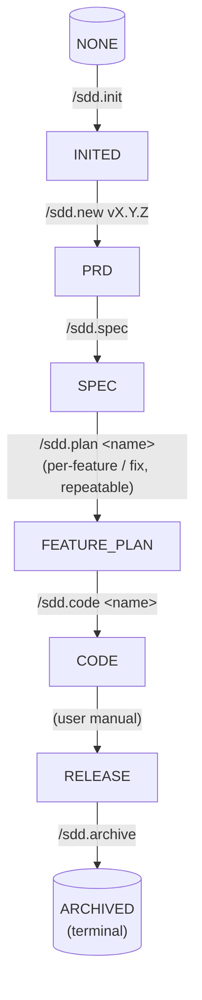

# SDD CodeAgent Plugin — 设计文档

- **日期**：2026-07-07
- **状态**：已批准（brainstorming 阶段完成）
- **作者**：Dachang (@dachang364-tech)
- **仓库**：`SDD-Land-Spec`（本仓库根目录）
- **实现语言**：简体中文（zh-CN）—— 所有面向用户的文案、模板、命令输出、状态信息、文档示例、错误提示、commit 模板均使用中文。命令名、文件路径、glob 模式、配置键、技术术语保留英文。

## 1. 目的与背景

构建一个 CodeAgent Plugin（manifest 形式），把作者本人「规范驱动开发」（Spec-Driven Development，SDD）的工作流封装成 Skills、Commands、Hooks 和运行时状态。该 Plugin 是一个**流程编排器**，不是方法论的重新实现 —— 它从现有框架（Superpowers、Spec-Kit、OpenSpec）中取其精华，与项目本地约定做胶水整合。

### 1.1 目标

- 通过一组明确的斜杠命令与自然语言触发器，把项目从**需求 → 上线 → 归档**完整跑下来。
- 把文档（`spec.md`、`feature-*.md`、`fix-*.md`、DR、PRD）作为一等资产，存放在 `docs/vX.Y.Z/` 之下。
- 通过**阶段许可护栏**：Agent 在错误阶段试图改不该改的文档（如在 FEATURE_PLAN 阶段写 `prd.md`）会被硬拦截，引导回正确阶段。源码本身不设路径白名单 —— 边界纪律由「**文档即契约**」保证，`spec.md` 是真理来源，code 必须符合 spec。
- 优先在 **Claude Code** 上跑通，对 OpenCode、CodeX 等其他 CodeAgent 通过显式的适配层接入。

### 1.2 非目标

- 不重新实现 brainstorming、TDD、verification —— 这些直接消费 Superpowers。
- 不从零写 spec / plan / tasks 模板 —— 借自 Spec-Kit（只做最小化定制）。
- 不构建跨平台运行时抽象层。每个平台单独一份薄薄的 adapter 目录。
- **Plugin 自身不适用 SDD 流程**：Plugin 是工具不是产品。其开发走普通 git workflow（feature branch、PR、CHANGELOG），不创建 `docs/vX.Y.Z/`、`state.json`、不跑 `/sdd.*`。
- **Plugin 的设计文档与 SDD 项目产物分离**：本设计文档目前位于 `docs/superpowers/specs/` 仅因 brainstorming skill 的默认输出位置；正式落地时 Plugin 仓库的设计/计划/ADR 文档应放在独立目录（例如 `plugin-docs/`、`docs/plugin/`），避免与使用 Plugin 的项目自身产生的 `docs/vX.Y.Z/` 命名冲突。

### 1.3 实现语言约束

Plugin 内部所有面向用户的字符串 —— Skill 正文、命令输出、状态报告、模板（`spec.md`、`feature-*.md`、`fix-*.md`、DR、PRD）、错误消息、commit-message 建议 —— 一律使用**简体中文**。以下内容保留英文：

- 斜杠命令名（`/sdd.*`）—— 是用户输入的标识符。
- 文件路径、glob 模式、manifest 键。
- 代码标识符、配置键、约定俗成的英文技术术语（如 `ADR`、`JSON`、`glob` 等）。
- 外部框架文档中的原文引用（如 Superpowers Skill 的标题）。

## 2. 架构总览

```
┌────────────────────────────────────────────────────────────┐
│            SDD CodeAgent Plugin（manifest 形式）            │
├────────────────────────────────────────────────────────────┤
│  Commands（指向 Skills 的薄别名）                            │
│   /sdd.init /sdd.new /sdd.spec /sdd.plan                    │
│   /sdd.research /sdd.prd /sdd.code                          │
│   /sdd.dr /sdd.status /sdd.archive /sdd.doctor              │
├────────────────────────────────────────────────────────────┤
│  Skills（承载实际方法论）                                    │
│   sdd-init-runner / sdd-new-version-bootstrapper            │
│   sdd-research-writer / sdd-prd-writer                      │
│   sdd-spec-writer / sdd-plan-writer                         │
│   sdd-code-orchestrator                                     │
│   sdd-dr-writer / sdd-status-reader / sdd-archiver          │
│   sdd-doctor-runner                                         │
├────────────────────────────────────────────────────────────┤
│  Hooks（路径 / 状态守卫）                                    │
│   SessionStart         — 向 context 注入项目状态             │
│   PreToolUse Write/Edit — 阶段许可检查（只拦文档类路径）       │
│   PostToolUse Write/Edit — 更新 state.json 时间戳             │
│   PreCompact           — 快照当前阶段产物路径                 │
├────────────────────────────────────────────────────────────┤
│  状态（.sdd/state.json）                                     │
│   version, phase, branch, artifacts,                            │
│   drs (DR 索引：spec 侧 drs[] ↔ DR 侧 affects[] 双向)                                 │
└────────────────────────────────────────────────────────────┘
           ↓ 调用 ↓
┌────────────────────────────────────────────────────────────┐
│  外部框架（不重新实现）                                       │
│   Superpowers: brainstorming / writing-plans / TDD /        │
│                verification-before-completion /             │
│                subagent-driven-development                  │
│   Spec-Kit:    specify / plan / tasks / converge 模板        │
│   OpenSpec:    archive / 变更管理模型                        │
└────────────────────────────────────────────────────────────┘
```

## 3. 状态机

```
NONE --/sdd.init--> INITED --/sdd.new vX.Y.Z--> PRD --/sdd.spec--> SPEC
                                                                                          |
                                                                                          | /sdd.plan <name>     (per-feature / fix, repeatable)
                                                                                          v
                                                                                    FEATURE_PLAN --/sdd.code <name>--> CODE
                                                                                                                      |
                                                                                                                      | (user manual)
                                                                                                                      v
                                                                                                                   RELEASE
                                                                                                                      | /sdd.archive
                                                                                                                      v
                                                                                                                  ARCHIVED
```

如果你的 Markdown 渲染器支持 Mermaid（如 GitHub、Obsidian、Typora ≥ 1.0），下面的版本会自动渲染为流程图（无等宽字体错位问题）：



**变更路径**（任何阶段的可选变更，详见 §3.2）：自然语言 + `/sdd.<目标阶段>` + `/sdd.plan <name>` 都走同一套流程 —— Skill 内部判断 `patch` / `breaking`，`breaking` 时给受影响的下游打 `needs_rework` 标记。subagent 在 dispatch 时若发现自身 plan 的上游在 `needs_rework` 列表里，**主动告警**但不自动重启。

**回跳语义**：任意阶段都可通过 `/sdd.<目标阶段>` 命令回跳到上游阶段（详见 §8 PreToolUse Hook 与 §7 各 Skill 的命令入口）。`state.json.phase` 写入由**命令入口**而非 Hook 完成，因此 Hook 看到的总是已稳定的 phase。

阶段可以重复进入（例如在 `FEATURE_PLAN` 阶段回头编辑 `spec.md`，phase 临时跳回 `SPEC`，改完后回到 `FEATURE_PLAN`）。`state.json.phase` 是**当前活动阶段**，不是历史最高。各产物的具体状态存放在 `state.json.artifacts.<name>.status`。

**用户可跳过 `/sdd.prd`**：用户可以自行编写 `prd.md`（自由格式），但若想走 `/sdd.spec`，消费的 PRD 必须符合 plugin 模板 schema（详见 §11.1），否则 `/sdd.spec` 会拒绝并提示「PRD 不符合规范，请用 `/sdd.prd` 重写或手动补齐章节」。同样的，`/sdd.feature` 消费的 spec 也需符合 schema。

**关于上游两阶段（PRD / SPEC）**：两者构成严格链 `prd → spec`。Plugin 提供 `/sdd.prd` 命令，遵循 plugin 模板规范；用户也可以自行完成 PRD（自由格式），但**若想走 `/sdd.spec`，所消费的 PRD 必须符合 plugin 的 schema**（见 §11 模板清单）。下游不识别时 `/sdd.spec` 会拒绝并提示「PRD 不符合规范，请用 `/sdd.prd` 重写或手动补齐章节」。

**调研文档（requirements/）独立于版本阶段**：v0.1 把原本 `research.md` 从版本目录升级为项目级 `docs/requirements/`，由 `/sdd.research` 维护。`/sdd.prd` 启动时扫描并让用户挑选上游需求。`requirements/*.md` 不进 `state.json`，不参与状态机；修改不强制走 DR。

### 3.1 `.sdd/state.json` schema

```json
{
  "version": "1.0.1",
  "phase": "FEATURE_PLAN",
  "branch": "feat/v1.0.1-payment",
  "artifacts": {
    "prd": {
      "path": "docs/v1.0.1/prd.md",
      "status": "approved",
      "updated_at": "2026-07-07T09:00:00Z",
      "drs": []
    },
    "spec": {
      "path": "docs/v1.0.1/specs/spec.md",
      "status": "approved",
      "updated_at": "2026-07-07T10:00:00Z",
      "drs": ["spec-0007"]
    },
    "features": [
      { "name": "feature-login",   "path": "docs/v1.0.1/plans/feature-login.md",   "status": "planned" },
      { "name": "feature-payment", "path": "docs/v1.0.1/plans/feature-payment.md", "status": "coding" },
      { "name": "fix-0001-payment-null", "path": "docs/v1.0.1/plans/fix-0001-payment-null.md", "status": "draft" }
    ]
  },
  "drs": {
    "fix-0001-payment-null": {
      "tag": "fix",
      "path": "docs/v1.0.1/decisions/fix-0001-payment-null.md",
      "title": "payment-null-bug",
      "status": "closed",
      "closed_reason": "committed",
      "closed_via": "code",
      "committing": false,
      "commit_attempt": 0,
      "affects_frozen": true,
      "affects": {
        "specs":    ["specs/spec.md"],
        "features": ["feature-payment"]
      },
      "supersedes": [],
      "superseded_by": null,
      "created_at":  "2026-07-08T10:00:00Z",
      "closed_at":   "2026-07-09T12:00:00Z"
    },
    "spec-0007-clarify-email": {
      "tag": "spec",
      "path": "docs/v1.0.1/decisions/spec-0007-clarify-email.md",
      "title": "clarify-email-format",
      "status": "closed",
      "closed_reason": "committed",
      "closed_via": "doc",
      "committing": false,
      "commit_attempt": 0,
      "affects_frozen": true,
      "affects": {
        "specs":    ["specs/spec.md"],
        "features": []
      },
      "supersedes": [],
      "superseded_by": null,
      "created_at":  "2026-07-12T09:00:00Z",
      "closed_at":   "2026-07-12T11:00:00Z"
    }
  },
  "compaction_snapshot": null
}
```

**status 取值**：

- `artifacts.<name>.status`：`missing` | `draft` | `approved` | `deprecated`。`/sdd.new` 不预创建 `prd.md`，因此新建版本后 `artifacts.prd.status = "missing"`；`/sdd.prd` 完成后变 `draft`，用户批准后变 `approved`。`spec` / `features.*` 同理。
- `features[*].status`：`draft` | `planned` | `coding` | `done` | `deprecated`。**plan 文件名以 `fix-` 开头时**（由 `fix` 类 DR 触发），其 name 与 DR ID 同名，例如 `fix-0001-payment-null`。feature 数组同时承载 feature plan 与 fix plan。
- `drs[*].status`：`open` → (`committing`) → `closed`。
  - `closed` 时必填 `closed_reason`：`committed` | `superseded` | `dismissed`。
  - `closed_reason = committed` 时必填 `closed_via`：`code`（走 `/sdd.code` 完成） | `doc`（直接改文档 + git commit）。
  - `committing: true` 表示 DR 处于「关闭流程进行中」过渡态——下游（`/sdd.code` / 文档 commit）未完成。
  - `affects_frozen: true` 表示 `affects` 字段已冻结（`committing` 起冻结；`open` 阶段为 false）。
  - `commit_attempt: int` 表示第几次尝试 close（首次 0），失败重试时递增。

**`committed` 统一终态命名**：影响代码（fix/feat/chg/arch）与不影响代码（spec/doc/typo）的 DR 都用 `committed` 作为关闭理由——前者由 `/sdd.code` 完成触发，后者由 git commit 触发，通过 `closed_via` 字段区分路径。

**`artifacts.<name>.drs`**：受本资产影响的 DR ID 列表。**双向映射的 spec 侧**——通过它 0(1) 反查「这份 spec 受哪些 DR 影响」。

**`drs[*].affects`**：**双向映射的 DR 侧**——本 DR 影响哪些 spec 资产与 feature plan。

**`v0.1` 不引入 `guards` 字段**：v0.1 阶段不实施「Coverage Scope 路径白名单」护栏。Hook 退化为「阶段许可」（详见 §8）。后续版本如需恢复路径白名单，作为不破坏 schema 的扩展字段加回。

### 3.2 变更流程：DR（Decision Record）决策模型

**所有变更走「DR 决策记录」**，无论来源是 PRD / spec / plan / 代码。DR 是变更的唯一语义载体，不存在 `last_change_type` / `needs_rework` 之类的隐式标记。

#### DR 类型（前缀 tag）

**影响代码的 DR**（`closed_via = code`）：

| tag   | 含义                             | 文件名示例                          |
| ----- | -------------------------------- | ----------------------------------- |
| fix   | 修 bug 使其匹配期望              | `fix-0001-payment-null.md`          |
| feat  | 功能新增                         | `feat-0002-add-sso-login.md`        |
| chg   | 功能修改（已有行为调整）         | `chg-0003-payment-retry-policy.md`  |
| arch  | 架构、依赖、库选型调整           | `arch-0004-axios-to-fetch.md`       |

**不影响代码的 DR**（`closed_via = doc`）：

| tag   | 含义                             | 文件名示例                          |
| ----- | -------------------------------- | ----------------------------------- |
| spec  | spec.md 表达修订，行为不变       | `spec-0005-clarify-email-rule.md`   |
| doc   | 文档结构调整 / 重写，语义不变    | `doc-0006-restructure-decisions.md` |
| typo  | typo / 错别字 / 缺失标点         | `typo-0007-fix-section-header.md`   |

> **NNNN 跨 tag 共享同一序号池**：`fix-0001`、`spec-0005` 共用全局递增（`max(existing) + 1`）。
> 默认不加 `mig`（migration）、`meta`（仓库元数据）等边缘 tag。出现时再扩展。

#### 状态机

```
                            ┌──────────────── dismiss ────────────────┐
                            │                                         │
  (无) ──/sdd.dr──> open ──┴── accept ──> committing ──成功──> closed (committed)
                            │                  │
                            │                  └─失败──> open（保留草稿）
                            │
                            └── dismiss ──> closed (dismissed)
```

**字段语义**：

| 字段 | 取值 | 说明 |
| ---- | ---- | ---- |
| `status` | `open` \| `committing` \| `closed` | 状态机当前态 |
| `closed_reason` | `committed` \| `superseded` \| `dismissed` \| `null` | 关闭原因；`open` 阶段为 null |
| `closed_via` | `code` \| `doc` \| `null` | 仅 `closed_reason = committed` 必填 |
| `committing` | `true` \| `false` | `committing` 阶段为 true，表示关闭流程进行中 |
| `affects_frozen` | `true` \| `false` | `open` 阶段 false（可改）；`committing` 后 true（冻结） |

**关口语义**：

- **`open → committing`**：用户调 `/sdd.dr accept <id>`，确认 tag 与 `affects`。
- **`committing → closed (committed)`**：影响代码 → `/sdd.code` 完成；不影响代码 → 文档 commit + 章节变更履历 append。
- **`committing → open`**：关闭流程中途失败，回退（保留 DR 文件草稿 + `affects` 字段；只重置 `committing=false` + `commit_attempt+=1`）。章节变更履历**不**append（避免污染）。
- **`open → closed (dismissed)`**：用户判断偏差不成立。`committing` 与 `closed (committed)` **不**允许 dismiss——错误时另起 DR `supersede` 旧 DR。
- **`closed (committed) → closed (superseded)`**：被新 DR 取代（仅在取代方 `closed (committed)` 时触发，新 DR 自身的 `supersedes` 字段声明意图，committed 时才回填旧 DR 的 `superseded_by`）。

#### 入口

所有 DR 起草都通过 `sdd-dr-writer`（§7.7）。三种触发形式：

```
自然语言触发      :  "payment 退款失败" / "spec 里的邮箱校验规则要细化"
/sdd.dr [tag]    :  /sdd.dr fix payment-null
代码完成后的提问  :  /sdd.code <name> 完成 → sdd-code-orchestrator 询问
                      「本次实现是否符合 spec？」→ 否 → 起草 DR
```

**主要触发点是 CODE 完成点**：`/sdd.code` 完成所有 task 后，`sdd-code-orchestrator` 主动询问用户本次实现是否符合 spec；"不符合"直接进入 DR 起草流程。

**`/sdd.dr` 命令**：横切命令，可从任何阶段调起。用户主动说「我要写一个 DR」时无需等代码完成。

#### DR 与 spec 双向关联（三层）

**A. 文件头部表格**（双向强引用）

`specs/spec.md` / `feature-*.md` 顶部：

```markdown
## 关联 DRs

| DR ID        | tag   | title             | status     | date       |
| ------------ | ----- | ----------------- | ---------- | ---------- |
| fix-0001     | fix   | 退款未触发邮件    | closed (committed) | 2026-07-09 |
| spec-0007    | spec  | 邮箱校验规则      | closed (committed) | 2026-07-12 |
```

DR 文件头部：

```markdown
## 影响的 spec 资产

| 资产                        | 章节 / ID       |
| --------------------------- | --------------- |
| specs/spec.md               | §3.1 注册流程   |
| plans/feature-payment.md    | Task 2          |
```

**B. 章节级「变更履历」**

`spec.md` 每个一级章节之后追加：

```markdown
### §3.1 注册流程

（章节内容…）

<details><summary>变更履历</summary>

| 序号 | DR ID      | tag  | 摘要                              |
| ---- | ---------- | ---- | --------------------------------- |
| 1    | fix-0001   | fix  | 退款流程补充退款成功邮件触发条件 |
| 2    | spec-0007 | spec | 明确邮箱格式必须 RFC5322 兼容     |

</details>
```

**C. `state.json` 双向索引**（见 §3.1）：

```jsonc
"spec": {
  "path": "docs/v1.0.1/specs/spec.md",
  "drs": ["fix-0001", "spec-0007"]      // ← spec 侧：哪些 DR 影响了我
},
"drs": {
  "fix-0001": {
    "tag": "fix",
    "status": "closed",
    "closed_reason": "committed",
    "closed_via": "code",
    "committing": false,
    "affects_frozen": true,
    "affects": {                         // ← DR 侧：我影响了谁
      "specs":    ["specs/spec.md"],
      "features": ["feature-payment"]
    }
  }
}
```

#### supersede 与 dismissed

- **supersede 延迟回填**：新 DR `open` 阶段只往自己的 `supsersedes` 字段写「我要取代谁」（意图声明，不污染旧 DR）。**只有**新 DR `closed (committed)` 时**才**回填旧 DR 的 `supserseded_by` 字段（事实落地）。
  - 好处：若新 DR 中途被 `dismissed`，旧 DR 完全不受波及，章节变更履历不污染。
  - 过渡期窗口：旧 DR 在 `closed (committed)` 状态期间，新 DR `open` 声明 supersede 但未 close —— 旧 DR 不打标；消费方读 `superseded_by` 为 null 表示「无取代」。
  - spec 章节的「变更履历」表 append 时机：新 DR `closed (committed)` **真正成功**后才 append。
- **dismissed 范围限定**：仅 `open` 阶段可 dismiss。`committing` 与 `closed (committed)` 阶段**不允许** dismiss —— 错误时另起 DR `supersede` 旧 DR。dismissed 的 DR 不留 dirty 标记（spec 资产头部「关联 DRs」表不追加、章节变更履历不 append）。

#### DR 与下游派发的协同

`/sdd.code <feature>` 在 subagent dispatch 时：

1. 读 `state.json.artifacts.spec.drs` 与 `state.json.drs[*].affects`
2. 若目标 feature 受 `committing` 或 `closed (committed)` DR 影响（`affects_frozen = true` 且 `closed_reason ∈ {committing, committed}`）→ **主动告警**「本 feature 受 in-progress / committed DR <id> 影响，建议先 review 该 DR 的 `affects`」，**不**自动重启也不拒绝派发。

> 旧版「`needs_rework` 告警」机制**完全废弃**，DR 的 `affects` 是唯一信号源。

#### 入口精简回顾

| 入口                       | 何时用                            | 走哪个 Skill          |
| -------------------------- | --------------------------------- | --------------------- |
| `/sdd.dr [tag] <title>`    | 用户主动写 DR                     | `sdd-dr-writer` (§7.7) |
| `/sdd.code <name>` 完成后  | 测试发现功能不符合 spec 验收标准  | `sdd-dr-writer`       |
| `/sdd.<阶段>`（spec/prd 等）| 起草 / 修改文档                   | `<阶段>-writer` + 必要时先写 DR |

不强制所有 `/sdd.spec` / `/sdd.prd` 调用都先写 DR —— 对纯 typo / 表达修订（小工作量、低风险）仍可走原始 Skill；DR 是**显式记录器**，不替代直接修改。

### 3.3 CONSTITUTION.md 宪法

`.sdd/CONSTITUTION.md` 是**项目级流程强制约束文件**，与 `CLAUDE.md` / `AGENTS.md`（项目偏好）职责不重叠。三者加载顺序与优先级：

| 文件 | 作用域 | 谁写 | 优先级 |
| ---- | ------ | ---- | ------ |
| `.sdd/CONSTITUTION.md` | SDD Plugin 强控流程 | Plugin 生成默认骨架 + 项目 owner 增删 | **最高** |
| `CLAUDE.md` / `AGENTS.md` | 项目偏好（语言、风格、命名） | 项目 owner 自由写 | 次高 |
| `Skill description` | Plugin 各 Skill 自身的入口约定 | Plugin 自身 | 最低 |

启动 Claude Code 时按 **CONSTITUTION → CLAUDE.md → Skill description** 顺序加载。后加载的不覆盖前者 —— 宪法是**最高优先级**。

#### 文件位置与生成时机

- 路径：`.sdd/CONSTITUTION.md`（与 `state.json` / `progress.md` 同级）
- 由 `sdd-init-runner` 在 `/sdd.init` 时生成**全量默认骨架**（八章节占位 + 默认条款）
- 项目 owner 可自由增删章节、调整条款或降低 severity；Plugin **不**阻止修改，只在读取时按当前文件内容生效

#### 严重程度语义

每条规则带 `severity` 标记：

| severity | 含义 | 违反时处理 |
| -------- | ---- | ---------- |
| `must`   | 强制约束 | PreToolUse Hook 拒绝 + 报错；如需跳过，先改 severity 为 `should` |
| `should` | 推荐约束 | PreToolUse Hook 警告 + 提示；可手动 override |
| `may`    | 提示 | 不警告、不拦截；仅作信息 |

#### 八章节骨架（Plugin 默认全量内容）

```markdown
# CONSTITUTION

> SDD Plugin 项目级流程强制约束。修改请保留章节结构，只改 severity / 细则。

## 1. 阶段门控
- must: phase 推进必须由 `/sdd.<阶段>` 命令入口触发，禁止直接 Edit 切 phase

## 2. DR 流程
- must: 任何修改代码（fix / feat / chg / arch）前必须先有 `affects_frozen=true` 的 DR（即状态机 ≥ committing 的 DR）
- must: 跨版本修改代码必须先 `/sdd.dr` 起草 DR，不能 `/sdd.code` 绕过 DR
- must: 修改 specs/spec.md / feature-*.md 前必须有 spec / doc DR 且 `affects_frozen=true`
- must: 修改 prd.md 前必须有 spec DR 且 `affects_frozen=true`（PRD → spec 顺序）
- must: DR 进入 `committing` 前，spec.md 顶部「关联 DRs」表必须已 append 本 DR
- may: typo 类修订可跳过 DR
- may: `docs/requirements/*.md` 修订不强制走 DR（项目级跨版本调研文档，与代码 / 契约无关；不写 state.json，追溯走 git 历史）

## 3. Skill 身份
- must: 各 Skill 边界不可越权（例：sdd-spec-writer 不能改代码）

## 4. subagent 调度
- must: 主 Agent 是 state.json 的唯一写者
- must: subagent 通过 `.sdd/progress.md` 间接表达进度

## 5. Hooks 行为
- must: 不允许绕过 PreToolUse 直接 Write docs/vX.Y.Z/ 路径
- must: 写文档必须通过 `/sdd.<阶段>` 命令入口，命令入口内部切 phase 后再调 Skill

## 6. 多 Skill 协作
- must: skill 之间的接口契约不可破坏（plan → code、dr → plan 等）

## 7. 错误处理
- must: 错误状态展示与恢复路径一致，不允许静默吞错

## 8. 门控破坏检测
- must: /sdd.doctor 必须检查最近 N 次状态变化是否违反宪法 §1-§7
```

#### 读取点

| 读取点 | 时机 | 行为 |
| ------ | ---- | ---- |
| **SessionStart Hook** | Claude Code 启动 / 恢复会话 | 读取全文注入 `additionalContext`；主 Agent + subagent + Skill 都受约束 |
| **PreToolUse Hook** | 即将 Write/Edit 文档类路径 | 比对操作意图与 `must` 条，违反则**拒绝** + 报错；`should` 警告 |
| **主流程 Skill 入口** | sdd-dr-writer / sdd-plan-writer / sdd-spec-writer / sdd-code-orchestrator 启动时 | 读 §1「阶段门控」+ §2「DR 流程」作前置判断依据 |
| **/sdd.doctor** | 诊断运行时 | 跑 §8「门控破坏检测」检查最近 N 次状态变化是否违反宪法 |

#### 与 §3.2 DR 流程的关系

宪法是 DR 流程的**强制执行层**，§3.2 是**流程定义层**。DR 流程定义了"如何走变更"，宪法定义了"必须走变更（不可绕过）"。任何识别到代码变更的场景（包括 bugfix、refactor、feature、arch）都强制走 DR 流程；直接 `/sdd.code` 改代码而不先起草 DR 会被宪法 §2 拒绝。

## 4. 目录结构

```
<project root>/
├── .sdd/
│   ├── CONSTITUTION.md        # 项目级流程强制约束（Plugin 默认骨架 + 项目 owner 增删）
│   ├── state.json             # 状态机持久化
│   └── progress.md            # subagent ledger（实现进度真账）
├── docs/
│   ├── requirements/                    # 跨版本共享的调研文档（项目级，不进 state.json）
│   │   ├── user-interview-2026-06.md
│   │   ├── competitor-analysis.md
│   │   └── tech-research-rust-vs-go.md
│   ├── vX.Y.Z/                         # 当前进行中的版本（与 PRD 绑定）
│   │   ├── prd.md                       # 产品需求文档（Plugin 模板规范；头部含「上游需求文档」表）
│   │   ├── specs/
│   │   │   └── spec.md                 # 功能规范（output，Spec-Kit 风格）
│   │   ├── plans/
│   │   │   ├── feature-login.md        # 单 feature 实现计划（Superpowers writing-plans 风格）
│   │   │   ├── feature-payment.md
│   │   │   └── fix-0001-payment-null.md   # fix plan（由 fix DR 驱动 /sdd.plan 生成）
│   │   └── decisions/
│   │       ├── arch-0001-use-postgresql.md   # DR（架构决策）
│   │       └── fix-0001-payment-null.md      # DR（变更决策）
│   └── archive/
│       └── v1.0.0/                     # 已归档版本（迁移过来，不双份并存）
│           ├── prd.md
│           ├── specs/spec.md
│           ├── plans/
│           └── decisions/
└── （源代码目录，不动）
```

### 4.1 文档层级与递进

**双层结构**：项目级 `docs/requirements/` 与版本级 `docs/vX.Y.Z/`。

```
docs/requirements/*.md           <- 项目级调研（跨版本共享，docs/requirements/ 多维度）
docs/v1.0.1/prd.md               <- 版本级：业务目标 / 用户 / 范围 / 指标（1 份，Plugin 模板；头部含「上游需求文档」表）
  | 拆成 feature
spec.md                          <- 版本级：每个 feature 的 User Story + 验收标准 + 项目层元信息
  | 按 feature / fix 拆实现
feature-<name>.md                <- 版本级：单 feature 实现层：user story -> task
fix-<ID>.md                      <- 版本级：fix DR 触发的实现层：DR `committing` 后由 /sdd.plan 生成
  | 派给 subagent
源码 + 提交
```

`requirements/` 与版本目录**正交**：requirements 跨多个版本复用，PRD 仅引用路径与摘要。

**层级关系**：`feature > user story > task`。
- 一个 PRD 通常拆成 N 个 feature（如「登录」「支付」）。
- 一个 feature 含 N 个 user story（spec.md 里 P1/P2/P3 切片）。
- 一个 user story 拆成 N 个 task（feature-*.md 里的 `[ID] [P?] [Story]`）。

**Plan 与 Spec 的对应关系**：

| 维度           | `spec.md`                                                 | `feature-<name>.md` / `fix-<ID>.md`                  |
| -------------- | --------------------------------------------------------- | --------------------------------------------------- |
| 数量           | 1 份（按版本）                                            | 按需 N 份                                           |
| 粒度           | 粗：User Story、验收标准、Technical Context / Constitution / Project Structure | 细：具体文件、具体任务、TDD 步骤、commit 粒度 |
| 回答的问题     | "vX.Y.Z 整体要做什么？整体技术语境与项目结构是什么？"      | "feature-X / fix-<ID> 具体怎么落地？"               |
| 类比外部框架   | Spec-Kit `spec.md` + 融合的 `plan.md` 项目层              | Superpowers `writing-plans`                         |
| 任务列表       | 不展开任务                                                | 详细任务列表（`[ID] [P?] [Story] <描述>`）          |
| 谁执行         | `/sdd.spec`                                               | `/sdd.plan <name>`                                  |

**撰写约定**：
- `spec.md` 的「项目层元信息」部分（Technical Context / Constitution Check / Project Structure）是后续所有 `feature-*.md` 的**统一前置上下文**；每个 plan 顶部建议写一句 `> 上游：docs/vX.Y.Z/specs/spec.md`，保持可追溯。
- 跨 feature 改动对方文件**没有护栏拦截**（v0.1），但 review 时应回到 spec.md 标注影响面。

## 5. 命令与 Skill 对应

| 命令               | 内部 Skill                  | 写入路径                                              | 前置条件                |
| ------------------ | --------------------------- | ----------------------------------------------------- | ----------------------- |
| `/sdd.init`        | `sdd-init-runner`          | `.sdd/`、`docs/`                                      | —                       |
| `/sdd.new vX.Y.Z`  | `sdd-new-version-bootstrapper` | `docs/vX.Y.Z/{prd.md,specs,plans,decisions}/`、`state.json` | 项目已初始化         |
| `/sdd.research`    | `sdd-research-writer`       | `docs/requirements/<slug>-<yyyy-mm>.md`（多产出）   | phase ≥ INITED（不限阶段） |
| `/sdd.prd`         | `sdd-prd-writer`            | `docs/vX.Y.Z/prd.md`                                  | research approved（推荐） |
| `/sdd.spec`        | `sdd-spec-writer`           | `docs/vX.Y.Z/specs/spec.md`                           | prd 存在且符合规范     |
| `/sdd.plan <name>` | `sdd-plan-writer`           | `docs/vX.Y.Z/plans/feature-<name>.md` 或 `fix-<ID>.md` | spec 已批准，且 name 与对应 DR 的 plan 模式一致 |
| `/sdd.code <name>` | `sdd-code-orchestrator`     | 源文件（通过 subagent + TDD）                         | 对应 plan 已批准        |
| `/sdd.dr`          | `sdd-dr-writer`             | `docs/vX.Y.Z/decisions/<tag>-NNNN-*.md`               | phase ≥ INITED（横切） |
| `/sdd.status`      | `sdd-status-reader`         | （无）                                                | —                       |
| `/sdd.archive`     | `sdd-archiver`              | `docs/archive/vX.Y.Z/`                                | phase = RELEASE         |
| `/sdd.doctor`      | `sdd-doctor-runner`         | （无；只读）                                          | —                       |

每个 Skill 同时支持自然语言触发：Skill 的 `description` 字段按用户可能的说法撰写，所以用户即使说「帮我写一下支付功能的 spec」，也能命中 `sdd-spec-writer`，不必输入斜杠命令。

**横切命令**：`/sdd.dr` 与 `/sdd.doctor` 是横切命令，可从任何阶段调起（`/sdd.dr` 要求 phase ≥ INITED；`/sdd.doctor` 任意），不改变 `state.json.phase`。其余命令都是顺序主流程命令。

## 6. 各阶段外部框架组合

| 阶段        | Plugin Skill              | 外部框架层                                                              |
| ----------- | ------------------------- | ----------------------------------------------------------------------- |
| 需求调研    | `sdd-research-writer`     | Superpowers `brainstorming` 流程 + Plugin 原生 research 模板            |
| PRD         | `sdd-prd-writer`          | Superpowers `brainstorming` 流程 + Plugin 原生 PRD 模板；启动时扫描 `docs/requirements/*.md` 让用户挑选上游需求 |
| 需求（spec）| `sdd-spec-writer`         | 读取 PRD 作为输入；调用 Superpowers `brainstorming` 流程；用 Spec-Kit `spec.md` 模板（User Story、Given-When-Then）**融合** Spec-Kit `plan-template.md` 的项目层章节（Technical Context / Constitution Check / Project Structure） |
| Feature/Fix Plan | `sdd-plan-writer`     | Superpowers `writing-plans` 流程（文件级任务、TDD 步骤、commit 粒度）；fix 模式走同一 Skill，复用 `writing-plans` |
| 编码        | `sdd-code-orchestrator`   | Superpowers `subagent-driven-development` + `test-driven-development` + `verification-before-completion` |
| DR          | `sdd-dr-writer`           | Plugin 原生（DR 模板见 §7.7）                                            |
| 状态        | `sdd-status-reader`       | Plugin 原生                                                              |
| 归档        | `sdd-archiver`            | Spec-Kit `/speckit.converge` 查漏 + OpenSpec 归档模型                    |
| 诊断        | `sdd-doctor-runner`       | 不调外部框架；纯 Plugin 原生只读自检（详见 §7.10）                       |

## 7. 关键 Skill — 内部行为

> 编号自 7.0 起按仓库 `skills/` 目录的字典序编排。`sdd-init-runner`（7.0）、`sdd-new-version-bootstrapper`（7.1）属于项目级启动 Skill；`sdd-research-writer`～`sdd-doctor-runner`（7.2～7.10）属于版本级阶段 Skill。**11 个 Skill 一一对应 §11 列出的 11 个目录**。

### 7.0 `sdd-init-runner`

1. 检测当前项目是否已初始化（`.sdd/state.json` 是否存在）。
   - 不存在 → 继续
   - 存在 → 检测 `.sdd/state.json.initialized` 字段：
     - `true` → 拒绝并提示「已初始化，请用 `/sdd.status` 查看当前状态」
     - `false`（半成品）→ 询问用户「上次安装中断，是否清理重试？」：
       - `y` → 删 `.sdd/` 整目录后从步骤 2 重来
       - `n` → 中止退出
2. 创建 `.sdd/` 目录与 `state.json` 初始骨架（`initialized = false`、`version = "0.0.0"`、`phase = "INITED"`、`artifacts = {}`）。
3. **调用 `scripts/install-deps.sh`**（POSIX bash，由本 Skill 通过 bash 调用）安装 Spec-Kit / Superpowers。
   - 脚本退出码 0 → 步骤 4
   - 非零 → 删 `.sdd/`（清理重试态）+ 报错，提示用户「请先手动运行 `scripts/install-deps.sh` 后重试 `/sdd.init`」
4. **验证依赖到位**：检查 `claude plugin list` 输出包含 `superpowers` 与 `spec-kit`；任一缺失 → 同步骤 3 失败处理（清理 + 报错）。
5. 创建 `docs/` 目录结构。
6. **不**预创建任何版本目录；版本目录由 `/sdd.new` 启动。
7. 若项目根不是 git 仓库，**不强制** git init，但提示「建议先 `git init` 以便后续归档写入 commit」。
8. 写入 `.sdd/CONSTITUTION.md` 默认骨架（见 §3.3 八章节占位 + 默认 `must` 条款）。项目 owner 可自由增删。
9. 把 `state.json.initialized` 字段标为 `true`，完成初始化。

### 7.1 `sdd-new-version-bootstrapper`

1. 要求项目已初始化（`state.json.version != "0.0.0"` 或 `phase = "INITED"`）。
2. 解析用户提供的版本号（`/sdd.new vX.Y.Z`），校验 semver。
3. 创建 `docs/vX.Y.Z/{research,specs,plans,decisions}/` 四个子目录。
4. 初始化各 artifacts 占位为 `missing`（prd / spec / features）。
5. `state.json.version = "vX.Y.Z"`、`phase = "PRD"`。
6. 创建 `git checkout -b feat/vX.Y.Z-<name>`（若项目是 git 仓库；非 git 项目跳过，仅提示）。

### 7.2 `sdd-research-writer`

1. 读取 `state.json`。若 `phase < INITED`，直接拒绝。
2. 调用 **Superpowers `brainstorming`** 流程：一次问一个澄清问题，围绕「要解决什么问题、用户是谁、用户痛点、竞品现状、初步范围」。
3. 用 Plugin 原生 research 模板填充：问题陈述 / 目标用户画像 / 痛点清单 / 竞品对比 / 初步范围（in/out）/ 可衡量的目标。
4. **多产出**：根据调研主题类型拆分多份调研文档，每份对应一个**调研维度**（用户访谈 / 竞品分析 / 技术预研 / 市场现状 / 其他）。所有产出写入 `docs/requirements/`，命名 `<topic-slug>-<yyyy-mm>.md`，例如 `payment-user-interview-2026-07.md`、`payment-competitor-2026-07.md`、`payment-tech-research-2026-07.md`。
5. **不进入 state.json**：`docs/requirements/*.md` 是项目级跨版本文档，**不**写入 `state.json.artifacts`。状态机不感知；变更追溯走 git 历史。
6. **不推进 phase**：research 阶段不设硬门（与原版不同）；用户可任意修改 `docs/requirements/*.md` 而不影响 `state.json.phase`。
7. 用户也可跳过本命令，自行编写 requirements/*.md（自由格式）。`/sdd.prd` 启动时扫描该目录并向用户呈现可选上游。

### 7.3 `sdd-prd-writer`

1. 读取 `state.json`。若 `phase < INITED`，直接拒绝。
2. **扫描上游需求**：扫描 `docs/requirements/*.md`，对每份生成元数据（path / 主题 / 摘要首段）。呈现给用户：
   ```
   检测到 N 份需求文档：
     1. docs/requirements/user-interview-2026-06.md   - 用户访谈（20 位目标用户访谈）
     2. docs/requirements/competitor-analysis.md       - 竞品分析（Stripe / Adyen 支付链路）
     3. docs/requirements/tech-research-rust-vs-go.md  - 技术预研（推荐 Rust + axum）
     4. docs/requirements/market-size-2026.md          - 市场规模（2026 H1 报告）
   
   哪些是本 PRD 的上游需求？[输入编号列表，或输入 a 全选，或输入 0 跳过]
   ```
   - 用户输入编号列表（`1,2,3`）→ 在 PRD 头部「上游需求文档」表写入这些 path
   - 用户输入 `a` → 全选
   - 用户输入 `0` 或目录无文档 → PRD 不带「上游需求文档」表（旧版行为兼容）
3. 调用 **Superpowers `brainstorming`** 流程：一次问一个澄清问题，最多 5 个，围绕「要解决什么问题、为谁、成功的标准、范围边界」。
4. 用 Plugin 原生 PRD 模板填充：项目背景 / 目标用户 / 核心问题 / 业务目标 / 范围（in/out）/ 关键指标 / 时间盒。**PRD 仅摘要提炼上游需求文档**，不贴原文；用户需深入时跳到 `docs/requirements/*.md` 读。
5. 写入 `docs/vX.Y.Z/prd.md`，头部「上游需求文档」表（若用户选了上游）放在文档最前。
6. 更新 `state.json.artifacts.prd.status = draft`。
7. **硬门**：用户未明确批准 PRD 前，不推进 `phase`。批准后 `status = approved` 且 `phase = PRD`。
8. PRD 既可由本命令生成，也可由人工提前放置（状态为 `approved`）。`/sdd.spec` 不区分 PRD 来源。

**PRD 头部新格式示例**：

```markdown
## 上游需求文档（references）

| 路径 | 主题 | 摘要 |
|------|------|------|
| docs/requirements/user-interview-2026-06.md | 用户访谈 | 20 位目标用户，痛点集中支付失败重试 |
| docs/requirements/competitor-analysis.md | 竞品分析 | Stripe / Adyen 等的支付链路对比 |
| docs/requirements/tech-research-rust-vs-go.md | 技术预研 | 推荐 Rust + axum，Go 作次选 |

## 产品需求

… 现有 PRD 内容（项目背景 / 目标用户 / 业务目标 / 范围 / 指标）…
```

### 7.4 `sdd-spec-writer`

1. 读取 `state.json` 与 `docs/vX.Y.Z/prd.md`；若 PRD 未批准则拒绝，并提示「先 `/sdd.prd` 或人工放置 PRD」。
2. 调用 **Superpowers `brainstorming`** 流程：基于 PRD 抽取 User Story，一次问一个澄清问题，最多 5 个。
3. 用 Spec-Kit `spec-template.md` 骨架填充：User Story（P1/P2/P3）、Acceptance Scenarios（Given-When-Then）、**并融合 Spec-Kit `plan-template.md` 中的项目层章节**（Technical Context / Constitution Check / Project Structure）作为 spec.md 的「项目层元信息」部分。
4. **保留引用**：在 `spec.md` 头部写明「输入 PRD：`docs/vX.Y.Z/prd.md`」（PRD 头部已含上游需求文档表），确保可追溯。
5. 写入 `docs/vX.Y.Z/specs/spec.md`。
6. 更新 `state.json.artifacts.spec.status = draft`。
7. **硬门**：用户未明确批准 spec 前，不推进 `phase`。批准后 `status = approved` 并 `phase = SPEC`。

### 7.5 `sdd-plan-writer`

**职责**：生成 per-feature 或 per-fix 的 plan，与 Superpowers `writing-plans` 机制 1:1 对齐。Spec-Kit 项目层元信息（Technical Context / Constitution Check / Project Structure）已在 `spec.md` 中包含（见 §7.4）。本 Skill 不再独立做"DR 起草"，那是 §7.7 `sdd-dr-writer` 的职责；fix 模式的入口只能由 DR `committing` 后驱动。

**两种模式**（依据用户输入的 `<name>` 前缀自动判定）：

- **feature 模式**（`/sdd.plan <feature-name>`）：
  1. 读取 spec.md；若 spec 未批准则拒绝。
  2. 调用 **Superpowers `writing-plans`** 流程，逐个收集该 feature 的技术决策（一次一个问题）。
  3. 写入 `docs/vX.Y.Z/plans/feature-<name>.md`，包含：文件结构、任务列表（`[ID] [P?] [Story] <带文件路径的描述>`）、每任务的 TDD 步骤、commit 粒度。
  4. **不另起 `tasks.md`** —— 任务内嵌在 plan 文档里，与 Superpowers 约定一致。
  5. 用户批准后，把 `artifacts.features[name].status` 标记为 `planned`，`phase = FEATURE_PLAN`（首次进入 FEATURE_PLAN）。

- **fix 模式**（`/sdd.plan <DR-id>`，由 `sdd-dr-writer` 在 `committing` 后自动调用，**不**支持用户直接调用 —— DR 流程在 `open → committing` 关口前置）：
  1. 读取 spec.md 与对应 DR（`drs[<DR-id>]` 的 `affects` 列表确定哪些 spec 资产 / feature 受影响）。
  2. 调用 **Superpowers `writing-plans`** 流程（同 feature 模式），任务围绕该 DR 描述的现象修复。
  3. 写入 `docs/vX.Y.Z/plans/<DR-id>.md`（与 DR 文件名同名去后缀）。
  4. 用户批准后，`artifacts.features[name=<DR-id>].status = planned`。fix 与 feature 共用 `features[*].status = "coding"` 表达「进行中」。

**推荐章节（v0.1 非强制）**：每份 plan 都可加 `## Coverage Scope`，列出本 feature / fix 涉及的关键文件 / 目录（gitignore 风格 glob）。该章节不写入任何 `state.json` 字段，也**不**作为护栏依据 —— v0.1 不实施路径白名单。

### 7.6 `sdd-code-orchestrator`

**进度基线**：直接沿用 Superpowers `subagent-driven-development` 的三个反上下文爆炸机制 —— **Fresh subagent per task** + **Ledger 持久化进度** + **文件交接而非粘贴文本**。本节仅记录我们与 Superpowers 的差异点。

1. 确认 `feature-<name>.md` 存在且已批准。
2. 调用 **Superpowers `subagent-driven-development`**，**不拆 plan**，逐 task 派发单 subagent。
3. 任务级别循环（每个 task 独立走完整轮）：
   - Implementer subagent：写失败测试 → 实现 → 通过测试 → 提交。
   - Task reviewer subagent：spec ✅ + 质量 ✅ → 写完成行到 ledger。
   - 每次提交前 / 提交后调用 `verification-before-completion`。
4. **Ledger 持久化**（核心新增，复用 Superpowers 机制、换路径）：
   - 路径：`<repo>/.sdd/progress.md`（**不**复用 `.superpowers/sdd/progress.md`，避免与 Superpowers 自身命名冲突 —— 见 K10）。
   - Skill 启动时 `cat` 该文件，**已完成 task 一律跳过**，避免重派（来源：Superpowers 「real session 一次性把整段 task 序列重派」是真实失败案例）。
   - 每个 task 的 review 通过后追加一行：`Task <N>: complete (commits <base7>..<head7>, review clean)`。
5. **文件交接优于文本粘贴**（沿用 Superpowers 约束）：
   - dispatch prompt 仅含：(a) 一句话项目背景；(b) 用 `task-brief PLAN_FILE N` 抽取的 brief 文件路径；(c) 上游任务产出的接口 / 决策摘要；(d) report 文件路径与回执契约。
   - **禁止**在 dispatch prompt 中粘贴累积历史（来源：Superpowers 「真实 session dispatch 42k 字符，其中 99% 是粘贴历史」）。
6. **PreToolUse Hook**（v0.1）不拦截源码路径；只对 `docs/vX.Y.Z/**` 文档路径做阶段许可检查。subagent 写源码时**无路径白名单约束**。
7. **state.json 同步**：subagent 与主 Agent **不共享** `state.json`。implementer 报告由 ledger 持久化（`progress.md` 才是真账），主 Agent 仅在 feature 整体完成时把 `artifacts.features[name].status` 推进到 `done`，并把任何跨 task 遗漏写进 `compaction_snapshot`。
8. **崩溃恢复**：主 Agent 下次 `SessionStart` 触发 `sdd-status-reader`，扫描 `progress.md` + `git log` 识别「最近完成行」之后的未完成 task，提示「之前中断，从 Task N 继续？」。**信任 ledger 与 git log，不信任自己的会话记忆**。

### 7.7 `sdd-dr-writer`

**职责**：起草、维护、归档 DR（Decision Record）。统一承载"架构决策"与"变更决策"，详见 §3.2。是 `/sdd.dr` 命令背后的唯一 Skill；也是其他主流程 Skill（`/sdd.code` 完成时）在 CODE 阶段主动询问"功能是否符合预期"后调起的 Skill。

**DR 文件位置与命名**：

```
docs/vX.Y.Z/decisions/<tag>-NNNN-<slug>.md
```

- `<tag>`：见 §3.2 DR 类型枚举（影响代码：`fix`/`feat`/`chg`/`arch`；不影响代码：`spec`/`doc`/`typo`）
- `NNNN`：四位数递增（`0001`, `0002`...），跨 tag 共享同一序号池，新 DR 取 `max(existing) + 1`
- `<slug>`：短横线分隔的小写短语（≤40 字符）

**前置判断（由 Skill 自动 + 用户确认）**：

启动 Skill 后先做启发式判断并让用户确认 `tag`（无须四问四答）：

```
1. 本次是否改变代码？
   是 → 影响代码分支：tag 候选 = fix / feat / chg / arch
   否 → 不影响代码分支：tag 候选 = spec / doc / typo

2. 读取目标 spec 资产 / plan，发现可能受影响的章节，列出候选 affects
   （用户可调整）
```

**模板**：

```md
# DR-<tag>-NNNN：<标题>

- 状态：open                                  # 起草后默认 open
- tag  ：fix|feat|chg|arch|spec|doc|typo
- 日期：YYYY-MM-DD
- 影响的 spec 资产：
  | 资产                        | 章节 / ID       |
  | --------------------------- | --------------- |
  | specs/spec.md               | §3.1 注册流程   |
  | plans/feature-payment.md    | Task 2          |

## 现象

（输入是什么、输出是什么、当前实际行为与期望的偏差是什么。**不写根因**——根因诊断在 `committing` 之后。）

## 期望

（按 spec 验收标准或用户表述，期望的正确行为是什么。）

## supersedes

（可选，被本 DR 取代的旧 DR ID 列表。）

## superseded_by

（自动维护：本 DR 被取代后由 Skill 写入新 DR 的 ID。）

## 关闭记录

（`closed (committed)` 之后由 Skill 自动追加 commit hash、关闭时间。）
```

**状态流转**（Skill 内部动作）：

| 起始 | 动作 | 终止 | 触发 |
| ---- | ---- | ---- | ---- |
| (无) | Skill 写模板 + 启发式推断 affects，状态 `open` | open | 用户 `/sdd.dr` |
| open | 用户确认 tag 与 `affects`（affects_frozen 转 true） | committing | `/sdd.dr accept <id>` |
| committing | 影响代码 → 生成 plan → 走 `/sdd.code` 完成；不影响代码 → 改 spec + git commit + append 章节变更履历；supersede 链回填 | closed (committed) | 自动（code 完成 / 文档 commit） |
| committing | 关闭流程中途失败，回退保留 DR 文件草稿 | open（重试） | 自动（异常） |
| open | 用户判断偏差不成立 | closed (dismissed) | `/sdd.dr dismiss <id> <reason>` |
| closed (committed) | 被新 DR `supersede`（仅新 DR `closed` 时回填） | closed (superseded) | 自动（新 DR `supersede` 链回填） |

**双向关联维护**（Skill 在状态流转时自动执行）：

- `(无) → open`：
  - DR 文件头部「影响的 spec 资产」表填入启发式推断 + 用户可调
  - `state.json.drs[<id>]` 写入 `status=open`、`closed_reason=null`、`committing=false`、`commit_attempt=0`、`affects_frozen=false`、`closed_via=null`
  - **不**写 `state.json.artifacts.spec.drs`、**不**追加 spec 资产头部「关联 DRs」表（open 阶段对消费方不可见）
- `open → committing`：
  - DR 文件状态字段：open → committing
  - `state.json.drs[<id>].status = "committing"`、`affects_frozen = true`、`committing = true`
  - `state.json.artifacts.spec.drs` 追加本 DR ID（受影响的每个 spec 资产都追加）
  - 在每个受影响 spec 资产头部「关联 DRs」表追加本 DR 行
- `committing → closed (committed)`（**成功路径**）：
  - DR 文件「关闭记录」段追加 commit hash + 关闭时间
  - `state.json.drs[<id>].status = "closed"`、`closed_reason = "committed"`、`closed_at = now`、`committing = false`
  - `closed_via` 写入：`tag ∈ {fix, feat, chg, arch}` → `"code"`；`tag ∈ {spec, doc, typo}` → `"doc"`
  - **supersede 链回填**：遍历本 DR `supsersedes` 字段里的每个旧 DR id → `state.json.drs[old_id].supserseded_by = <id>`、旧 DR `closed_reason` 转 `"superseded"`
  - **章节变更履历 append**：`closed_via = "doc"` 时，对每个 affected spec 章节追加「变更履历」表项；`closed_via = "code"` 时无 append（代码变更不影响章节）
- `committing → open`（**失败回退**）：
  - DR 文件保留草稿（不动「关闭记录」段）
  - `state.json.drs[<id>].status = "open"`、`committing = false`、`commit_attempt += 1`、`affects_frozen = false`
  - **不**回滚 `state.json.artifacts.spec.drs` 追加（避免再次被下游消费）/ **不**清空 affected 关联表
  - **不**append 章节变更履历
  - 重试由用户重新调 `/sdd.dr accept <id>` 触发
- `open → closed (dismissed)`：
  - DR 文件状态字段：open → closed (dismissed)，dismissed reason 由用户输入追加到「关闭记录」段
  - `state.json.drs[<id>].status = "closed"`、`closed_reason = "dismissed"`、`closed_at = now`
  - **不**写 `state.json.artifacts.spec.drs` / **不**追加 spec 资产头部「关联 DRs」表（dismissed DR 不污染下游）
  - **不**append 章节变更履历
- `closed (committed) → closed (superseded)`（由上一条 committing → closed (committed) 的 supersede 链回填自动触发）：
  - `state.json.drs[<old_id>].closed_reason = "superseded"`、`superseded_by = <new_id>`
  - DR 文件旧 DR 「关闭记录」段追加一句 supersede 记录

**supersede / dismiss 不删除历史**：spec 章节的「变更履历」表只 append，`/sdd.status` / `/sdd.doctor` 可查询历史 supersede / dismiss 链。

**执行与原 §7.5 关系**：

- 影响代码的 DR `committing` 后，由本 Skill 主动调起 `/sdd.plan`（`<name> = <DR id>`，例如 `fix-0001-payment-null`）生成 plan，再调起 `/sdd.code <name>`。
- 不影响代码的 DR `committing` 后：本 Skill 直接改 spec.md，commit 后置 `closed (committed)`、`closed_via = "doc"`、append 章节变更履历。

### 7.8 `sdd-archiver`

1. 要求 `phase = RELEASE`（由用户手动设置或通过发布 hook 触发）。
2. 调用 Spec-Kit `/speckit.converge` 检测各 feature plan 中未完成的工作；若有未完成任务，在用户未明确「强制归档」前拒绝。
3. **探测 git 可用性并自适应迁移**：
   - 若当前项目根目录是 git 仓库（即 `git rev-parse --is-inside-work-tree` 返回 `true`）：使用 `git mv docs/vX.Y.Z/ docs/archive/vX.Y.Z/`。提交一次 `chore(archive): migrate vX.Y.Z`。
   - 若当前项目**不是** git 仓库：使用纯文件 `mv docs/vX.Y.Z docs/archive/vX.Y.Z`，并在归档报告末尾追加一行 `⚠️ 当前项目不是 git 仓库，无法写入归档 commit；如需 git 历史，请先 git init 并补一次初始提交。`。
   - 文档不双份并存，无论 git / 非 git 模式均**先迁移再标记** state.json。
4. 把 `state.json.phase` 标记为 `ARCHIVED`，清空 `guards`，版本字段保留 `vX.Y.Z` 作为只读历史。
5. 归档后 `docs/` 下不再有 `vX.Y.Z/` 同名目录；要查阅历史文档只能从 `docs/archive/vX.Y.Z/` 走。

**为什么这么设计**：v0.1 不强制项目必须是 git 仓库（虽然 init 时会鼓励 `git init`）。归档路径语义在两种模式下完全一致 —— 「目录物理迁移到 archive」，唯一的差异是有 git 时由 git 负责记录历史，无 git 时由文件系统负责。

### 7.9 `sdd-status-reader`

报告：当前 `version`、`phase`、缺失的产物、`open` 状态的 DR、下一步推荐的斜杠命令。

### 7.10 `sdd-doctor-runner`

**职责**：只读诊断命令，输出统一清单。**不**自动修复，**不**改变 `state.json.phase`。横切命令（见 §5）。

诊断项分两组，输出 `✅ / ⚠️ / ❌` 三档：

**A. Plugin 自身安装完整性**（诊断当前 Plugin 仓库是否完整）：

| 检查项                              | 通过条件                                                                 |
| ----------------------------------- | ------------------------------------------------------------------------ |
| Plugin manifest                     | `.claude-plugin/plugin.json` 存在，`name` / `version` / `description` 字段非空 |
| 11 个 Skill 目录                    | `skills/sdd-{init-runner,new-version-bootstrapper,research-writer,prd-writer,spec-writer,plan-writer,code-orchestrator,dr-writer,archiver,status-reader,doctor-runner}/SKILL.md` 全部存在 |
| 11 个 command 文件                  | `commands/sdd.{init,new,research,prd,spec,plan,code,dr,status,archive,doctor}.md` 全部存在 |
| Hooks 配置                          | `hooks/hooks.json` 合法 JSON，四个事件都注册（SessionStart / PreToolUse / PostToolUse / PreCompact） |
| Templates 齐备                      | `templates/{research,prd,spec,feature-plan,dr}.md.tmpl` 全部存在 |
| Scripts 齐备                        | `scripts/{init,install-deps,archive,status,render-template}.js`（或 .sh）全部存在 |
| **外部依赖完备性**                  | `claude plugin list` 输出包含 `superpowers` 与 `spec-kit`                |

**B. 项目状态诊断**（诊断当前正在使用 SDD 的项目仓库）：

| 检查项                              | 通过条件                                                                 |
| ----------------------------------- | ------------------------------------------------------------------------ |
| `.sdd/state.json` 可解析            | JSON 合法，schema 字段齐全（`version` / `phase` / `branch` / `artifacts`）|
| 当前 phase 与文档路径一致           | `phase = PRD` 时 `prd.md.status == approved`；`phase = SPEC` 时 `spec.md.status == approved`；依此类推 |
| 文档目录 vs state.json 路径一致     | 每个 `artifacts.*.path` 字段对应的文件真实存在                            |
| `.sdd/progress.md` 与 git log 一致   | ledger 中标记 complete 的 task IDs 都能在 `git log` 中找到对应 commit hash 段 |
| 顶层模块变更提示                    | 最近 N 次提交新增了 `src/<new-module>/` 且没有对应 `decisions/*.md` 时，输出 `⚠️ 建议补一条 DR` |
| 宪法（CONSTITUTION）存在           | `.sdd/CONSTITUTION.md` 文件存在且能解析                                         |
| CONFORMANCE 检查                   | 读 CONSTITUTION §8「门控破坏检测」条款 + 最近 N 次 `git log` + `state.json.artifacts.*.drs` 数组，检查是否违反 §1-§7 must 条款 |

输出格式示例：

```
/sdd.doctor

依赖完备性
  ✅ superpowers v6.1.1（Plugin 已装，brainstorming / writing-plans / subagent-driven-development / test-driven-development / systematic-debugging / verification-before-completion 都可达）
  ❌ spec-kit 缺失（请运行 scripts/install-deps.sh 或 /sdd.init）

Plugin 自身安装
  ✅ .claude-plugin/plugin.json
  ✅ 11 个 Skill 目录
  ⚠️ commands/sdd.doctor.md 缺失（新增命令后忘了同步 commands/）
  ✅ hooks/hooks.json
  ✅ Templates 齐备
  ✅ Scripts 齐备

项目状态（当前仓库）
  ✅ .sdd/state.json 可解析
  ⚠️ phase = FEATURE_PLAN 但 specs/spec.md.status = draft（请运行 /sdd.spec 批准）
  ✅ 文档目录 vs state.json 路径一致
  ✅ progress.md 与 git log 一致
  ✅ CONSTITUTION.md 存在

CONFORMANCE（最近 10 次提交 vs 宪法 §1-§7）
  ❌ commit a1b2c3d 修改 src/payment/index.ts，但 state.json.drs 中无对应 fix/feat/chg DR
     违反 CONSTITUTION §2 "任何修改代码前必须有 affects_frozen=true 的 DR"
  ⚠️ commit d4e5f6a 修改 docs/v1.0.1/specs/spec.md，但 spec.md 顶部「关联 DRs」表未 append 本 DR
     违反 CONSTITUTION §2 "DR 关闭前 spec.md 顶部必须已 append 本 DR"

下一步建议：/sdd.dr fix <title> 起草 DR accept 后再继续。
```

**已知不做**：不检测外部框架（Superpowers / Spec-Kit / OpenSpec）的可达性 —— 这是用户的环境配置问题，不属于 Plugin 自检范围。

## 8. Hooks

| Hook                    | 触发时机                  | 动作                                                                       |
| ----------------------- | ------------------------- | -------------------------------------------------------------------------- |
| `SessionStart`          | Agent 启动 / 恢复会话     | **同时读取** `state.json` 与 `.sdd/CONSTITUTION.md`；把摘要 `<plugin>active version=...phase=...missing=[...] next=/sdd.<x>` + CONSTITUTION 全文 注入 context（Claude Code 的 `hookSpecificOutput.additionalContext`）。 |
| `PreToolUse Write/Edit` | 即将写入                  | **三层检查**（依次短路）：<br>**L1 路径合法性**：目标路径命中 `docs/vX.Y.Z/**` 时，按路径查「该路径对应的合法阶段集合」是否包含 `state.json.phase`，越阶段退出码 2。<br>- `prd.md` ↔ `PRD`<br>- `specs/spec.md` ↔ `SPEC`<br>- `plans/feature-*.md` ↔ `FEATURE_PLAN`、`CODE`<br>- `plans/fix-*.md` ↔ `FEATURE_PLAN`、`CODE`<br>- `decisions/**` ↔ 任何阶段（DR 是横切产物）<br>`docs/requirements/**` 不进入 L1 检查（项目级调研文档，不参与版本阶段门控）。<br>**phase 上下跳的处理**：用户想从 SPEC 阶段回跳改 `prd.md`，**不能**直接 Edit —— 必须调用 `/sdd.prd` 等命令入口。该命令入口在内部把 `phase` 切到目标阶段后，再调起对应的 Skill 写文档；Hook 始终读到的是**已稳定**的 phase，不会看到「写之前的瞬态切换」。<br>越阶段 → 退出码 2 + 提示「请运行 `/sdd.<对应阶段>`」。<br>**L2 宪法 must 条款**：识别本次写入语义（命令意图或路径 → 类别映射，例如写 `src/**` = 「改代码」、写 `docs/vX.Y.Z/specs/spec.md` = 「改 spec」、写 `plans/fix-*.md` = 「fix plan」）。比对 CONSTITUTION §2 的 must 条款：<br>- 「改代码」 → 必须有 `affects_frozen=true` 的 fix/feat/chg/arch DR（否则退出码 2 + 指向 `/sdd.dr`）<br>- 「改 spec」 → 必须有 `affects_frozen=true` 的 spec/doc DR（否则退出码 2 + 指向 `/sdd.dr`）<br>- 「改 prd」 → 必须有 `affects_frozen=true` 的 spec DR（否则退出码 2 + 指向 `/sdd.dr`）<br>应条款缺失时**不**硬拦，提示用户去 `/sdd.dr` 起草；用户在 `/sdd.dr` 完成 accept（即 `affects_frozen=true`）后重试原操作。<br>**L3 宪法 should 条款**：警告不拦截。<br>**v0.1 不拦截源码路径**（路径合法性只在 L1 文档类路径检查；源码路径只走 L2 宪法检查）。 |
| `PostToolUse Write/Edit`| 写入完成                  | ① 文档路径命中 `docs/vX.Y.Z/**` → 更新对应 `artifacts.<name>.status = draft`、`updated_at` 时间戳。<br>② 源码路径 → 更新 `state.json.last_modified`；若新增了顶层模块，提示「建议补一条 DR（建议 tag = `arch`）」。 |
| `PreCompact`            | 会话压缩                  | 把当前阶段产物路径快照写入 `state.json.compaction_snapshot`。下次 `SessionStart` 会重新注入，使被压缩过的 context 能找回这些文件路径。 |

Hooks **不**对方法论本身做二次判断（不审 spec 文字、不做 TDD 强制 —— 这些都在 Skill 里）。Hooks 只守护路径合法性、宪法强控、状态机一致性。

## 9. 错误处理

| 失败场景                            | 用户可见的表现                                                | 恢复方式                                                   |
| ----------------------------------- | ------------------------------------------------------------- | ---------------------------------------------------------- |
| `state.json` 缺失 / 损坏            | 「项目未初始化。请运行 `/sdd.init`。」                        | 运行 `/sdd.init`                                           |
| CONSTITUTION.md 缺失                | SessionStart 警告「项目无宪法强控」；PreToolUse L2 跳过只跑 L1 | `/sdd.init` 重生，或手动从模板拷贝                         |
| 改代码但无 affects_frozen DR          | PreToolUse 退出码 2 + 提示「请先 `/sdd.dr fix|feat|chg|arch <title>` 起草 DR 并 accept（进入 committing）」 | `/sdd.dr <tag> <title>` accept 后重试                       |
| 改 spec 但无 affects_frozen spec/doc DR | PreToolUse 退出码 2 + 提示「请先 `/sdd.dr spec|doc <title>` 起草 DR 并 accept」 | `/sdd.dr spec|doc <title>` accept 后重试                    |
| 改 prd 但无 affects_frozen spec DR    | PreToolUse 退出码 2 + 提示「PRD 修订需先有关联 spec 变更 DR」 | 先改 spec 或起草 spec DR accept                          |
| PRD 缺失或不符合 schema            | `/sdd.spec` 拒绝并提示「请先运行 `/sdd.prd` 或手动补齐 PRD 至符合规范。」 | 运行 `/sdd.prd` 或手动补齐 PRD 章节                     |
| 阶段跳跃（例如无 PRD 直接 `/sdd.spec`） | 命令拒绝并说明原因                                            | 运行前置命令                                               |
| 文档路径在错误阶段被改              | PreToolUse 退出码 2 并提示「请运行 /sdd.<对应阶段>」           | 切换到正确阶段                                             |
| 归档时仍有未完成任务                | `/sdd.archive` 拒绝并列出未完成项                              | 完成对应任务，或明确确认「仍然归档」                       |
| 脚本 IO / 网络失败                  | 抛出错误，**不破坏** `state.json`                             | 重跑；必要时从 `compaction_snapshot` 恢复                  |

## 10. 测试策略

| 层                              | 测试目标                                                       | 工具                                                       |
| ------------------------------- | -------------------------------------------------------------- | ---------------------------------------------------------- |
| 模板                            | 检查必要章节存在                                               | `bash` / `node` 快照对比脚本                                |
| Hook 与归档脚本                 | 单元级行为                                                     | `bats` / `shunit2`                                         |
| Skill 行为（端到端）            | 准备 mock `state.json`，注入用户输入，断言输出                 | Claude Code headless 调用；将产物与 golden snapshot 对比   |
| Hook 行为（集成）               | 准备临时仓库，驱动 Write 工具，断言「阶段许可」拦截            | `bats` 驱动真实的 agent 子进程                             |
| 跨平台 adapter smoke            | 为每个 adapter 生成产物，跑对应宿主加载器                       | v0.1 阶段人工验收；后续补 CI 脚本                          |

**YAGNI**：不做平台 mock 抽象层；不额外设置超出上表的覆盖率指标。

## 11. 平台适配策略

**v0.1 范围声明**：本版本仅交付 **Claude Code adapter**。OpenCode / CodeX / Cursor / Copilot CLI 等其他平台**不在 v0.1 范围**，等 Claude Code 版本稳定后再启动跨平台评估（见 §11.1）。

**没有 build.sh、没有 sources/adapters 中间层**（YAGNI）。Claude Code 直接消费仓库根目录，仓库根就是 Plugin 根。预期布局：

```
sdd-codeagent-plugin/
├── .claude-plugin/
│   └── plugin.json                 # Claude Code plugin manifest
├── commands/                        # /sdd.* 的薄别名（指向同名 Skill）
│   ├── sdd.init.md
│   ├── sdd.new.md
│   ├── sdd.research.md
│   ├── sdd.prd.md
│   ├── sdd.spec.md
│   ├── sdd.plan.md
│   ├── sdd.code.md
│   ├── sdd.dr.md
│   ├── sdd.status.md
│   ├── sdd.archive.md
│   └── sdd.doctor.md
├── skills/                          # 11 个 Skill，每个 Skill 一个目录
│   ├── sdd-init-runner/
│   ├── sdd-new-version-bootstrapper/
│   ├── sdd-research-writer/
│   ├── sdd-prd-writer/
│   ├── sdd-spec-writer/
│   ├── sdd-plan-writer/
│   ├── sdd-code-orchestrator/
│   ├── sdd-dr-writer/
│   ├── sdd-archiver/
│   ├── sdd-status-reader/
│   └── sdd-doctor-runner/
├── hooks/
│   └── hooks.json                  # SessionStart / PreToolUse / PostToolUse / PreCompact
├── templates/                       # research / prd / spec / feature-plan / dr
├── scripts/                         # init / archive / status / template-render
├── docs/
│   └── superpowers/
│       └── specs/
│           └── 2026-07-07-sdd-codeagent-plugin-design.md   # 本文档
├── README.md
└── LICENSE
```

**安装方式**：`/plugin install <repo-url>`（Claude Code marketplace 或 git 直装）；无需 build 步骤，仓库即产物。

**模板渲染**：Skill 运行时由脚本（如 `scripts/render-template.js`）读取 `templates/*.md.tmpl`，把变量替换后写入 `docs/vX.Y.Z/`。这是 Skill 内部步骤，与构建无关。

### 11.1 Plugin manifest 与外部依赖

#### `.claude-plugin/plugin.json`（Plugin manifest）

只声明 Plugin 自身信息，**不**声明外部依赖（避免依赖 Claude Code Plugin 系统的 `dependencies` 字段兼容性）：

```json
{
  "name": "sdd-codeagent-plugin",
  "version": "0.0.1",
  "description": "Spec-Driven Development Plugin"
}
```

**为什么 manifest 不声明 dependencies**：Claude Code Plugin 系统的 `dependencies` 字段可能在不同版本有差异；统一由 Plugin 自带的 `scripts/install-deps.sh` 兜底，行为更可控。

#### 外部依赖

| 依赖 | 用途 | 必需 |
| ---- | ---- | ---- |
| **Superpowers** | `brainstorming` / `writing-plans` / `subagent-driven-development` / `test-driven-development` / `systematic-debugging` / `verification-before-completion` | ✅ 必需 |
| **Spec-Kit** | `spec.md` / `plan.md` 模板 + `/speckit.converge`（archiver 用） | ✅ 必需 |

Plugin **硬依赖**：任一缺失 → 任何主流程命令拒绝运行。**不**做降级。

#### `scripts/install-deps.sh`

POSIX bash 脚本，Plugin 自带。检查 + 安装 Spec-Kit / Superpowers：

```bash
#!/usr/bin/env bash
# install-deps.sh - 调用 Claude Code CLI 装外部依赖 Plugin

set -e

check() {
  # 检测单个 Plugin 是否已装
  local plugin_name="$1"
  claude plugin list 2>/dev/null | grep -q "^${plugin_name}\b"
}

install() {
  # 安装单个 Plugin
  local plugin_name="$1"
  local source="$2"
  if check "$plugin_name"; then
    echo "[skip] ${plugin_name} 已装"
  else
    echo "[installing] ${plugin_name}..."
    claude plugin install "$source"
  fi
}

install "superpowers" "claude-plugins-official/superpowers"
install "spec-kit" "claude-plugins-official/spec-kit"

echo "[done] 所有依赖已就绪"
```

### 11.2 跨平台适配 —— 后续节奏

v0.1 **不**预留任何平台抽象层（YAGNI）。等 Claude Code adapter 稳定并经过实战验证后，再按以下顺序评估迁移：

- **候选 1**：OpenCode —— 需先验证其 loadout 模型对 Skills / Hooks / Subagents 三件套的实际支持度。若不全支持，按三档回退：全能力 / 缺 Hooks（无阶段护栏，命令顺序推进自负） / 仅 `/sdd.status` 与命令别名。
- **候选 2+**：CodeX、Cursor、Copilot CLI —— 按需求追加。

**触发条件**：Claude Code v0.1 在真实项目里跑完 1-2 个完整版本（research → archive），积累足够用户反馈后再启动。

### 11.3 依赖完备性时序

Plugin 保证依赖 Spec-Kit / Superpowers 装上的三道防线：

| 时机 | 触发点 | 行为 | 失败处理 |
| ---- | ------ | ---- | -------- |
| **首次安装** | 用户从仓库装本 Plugin | 由用户手动跑 `scripts/install-deps.sh`（manifest 不自动声明依赖） | 失败 → 装上后用户第一次 `/sdd.init` 时再次校验 |
| **`/sdd.init`** | 项目初始化命令 | 步骤 3 调用 `scripts/install-deps.sh`（已装则跳过）；步骤 4 验证依赖到位 | 缺失 → `/sdd.init` 退出码非零 + 报错 |
| **SessionStart Hook** | 每次会话启动 | 检查 Superpowers / Spec-Kit 是否可达；任何主流程 Skill 启动时再检查 | 任一缺失 → 报错 + 提示用户运行 `scripts/install-deps.sh`，**不**自动重跑（避免每次会话启动都做插件级安装） |

**为什么不在 SessionStart 自动重跑 install-deps.sh**：插件级安装成本高、易被网络阻塞打断；让用户主动跑更可控。

### 11.4 硬依赖缺失矩阵

| 命令 | Superpowers 缺失 | Spec-Kit 缺失 |
| ---- | ---------------- | -------------- |
| `/sdd.init` | 拒绝（依赖检查前置） | 拒绝 |
| `/sdd.new` | 接受（仅写版本目录） | 接受 |
| `/sdd.research` | 拒绝（需 brainstorming） | 接受 |
| `/sdd.prd` | 拒绝（需 brainstorming） | 接受 |
| `/sdd.spec` | 拒绝 | 拒绝（需 spec.md 模板） |
| `/sdd.plan` | 拒绝（需 writing-plans） | 接受 |
| `/sdd.code` | 拒绝（需 subagent + TDD + verification） | 接受 |
| `/sdd.dr` | 接受 | 接受 |
| `/sdd.archive` | 接受 | 拒绝（需 /speckit.converge） |
| `/sdd.status` | 接受 | 接受 |
| `/sdd.doctor` | 接受 | 接受 |

**Plugin 不做降级**：所有路径都是硬依赖，缺失则拒。理由：降级路径容易被误解为"功能正常"，掩盖真正问题。

## 12. 开放问题 / 后续工作

- **phase 字段语义**：当前 `phase` 同时承担「命令可达性」(a)、「文档写权限门控」(b)、「阶段推进写入」(c) 三件事。简化方案待讨论——可能解耦为「最大已完成阶段快照」+ 单独「当前写入目标」信号。当前版本保留多义。

- **state.json 并发**：v0.1 假定**主 Agent 是 state.json 的唯一写者**，subagent 通过 `.sdd/progress.md` 间接表达进度。**v0.1 不处理跨会话并发**（两个终端同时动 state.json）—— 不加文件锁、不做乐观合并。如果未来出现跨会话需求，再决定加 `.sdd/state.lock`（fcntl / Windows 兼容）还是改成 event-sourced。

- **Hook 脚本语言**：Claude Code 同时支持 bash 与 node hook，OpenCode 可能不同。逐 adapter 决定而非一刀切。
- **Bugfix 自动分类**：当前由 Skill 内部走决策树。若用户觉得过于严格，后续可加启发式规则（文件数量、变更行数、是否触及 spec 表面）做预分类。
- **跨版本 PRD 演子**：当前设计假定新版本独立起，PRD 需从 `docs/archive/<prev>/prd.md` 手工复制后再改。后续可加 `/sdd.new v1.0.1 --base v1.0.0` 简化。
- **多版本并行**：当前设计假定同一时间只有一个活跃版本。若出现并行维护分支（如同时维护 v1.0.x 与 v2.0.0），`state.json` 当前只支持单一版本 —— 后续可扩展为多版本数组。
- **Plugin 分发**：v0.1 稳定后，对接公开 plugin 市场（Claude Code 的 `claude-plugins-official`、OpenCode 的 loadout registry）。

## 13. 验收标准

v0.1 视为完成，当且仅当：

1. Plugin 能从本仓库安装进 Claude Code。
2. 用户能在一个空白仓库里依次运行 `/sdd.init` → `/sdd.new v0.0.1` → `/sdd.research` → `/sdd.prd` → `/sdd.spec` → `/sdd.plan demo` → `/sdd.code demo`，**仅在阶段门控点（PRD / spec / plan 批准）由用户做一次批准**，阶段之间不需用户写额外指导。
3. 在错误阶段试图改 `docs/vX.Y.Z/` 下的文档（如在 FEATURE_PLAN 阶段写 `prd.md`）会被 PreToolUse 硬拦截，并提示「请运行 /sdd.<对应阶段>」。
4. `/sdd.status` 在每个阶段都准确反映当前状态（包括 research / prd 状态、`features[*].status`），并能列出所有 `open` 状态的 DR。
5. `/sdd.archive` 能把 `docs/v0.0.1/` 通过 `git mv` 迁移到 `docs/archive/v0.0.1/`（包括 `prd.md` / `decisions/*.md`），原位置不再保留，并清空 `state.json` 中该版本相关字段。`docs/requirements/*.md` **不**随版本归档（项目级跨版本文档）。
6. 所有对外部框架（Superpowers / Spec-Kit / OpenSpec）的调用都通过 Skill 编排，不在 Plugin 内部复制实现。
7. **变更流程验证**：
   1. `/sdd.code <feature>` 完成后，用户回答「不符合」，触发起草 DR（`/sdd.dr fix <title>`），DR 状态走 `(无) → open → committing → closed (committed)`，过程中 `state.json.drs` 与受影响 spec 资产的「关联 DRs」双向同步更新。
   2. `/sdd.dr spec` 修改 spec.md 表达后，状态走 `open → committing → closed (committed, closed_via=doc)`，spec 资产对应的章节「变更履历」表自动 append 一行。
   3. 把已 `closed (committed)` 的 DR supersede：新 DR `open` 阶段 `supersedes` 含旧 DR ID；新 DR `closed (committed)` 时旧 DR `superseded_by` 才被回填；二者 spec 资产「关联 DRs」表都保留两行（历史可查）。
9. **宪法强控验证**：
   1. `/sdd.init` 后 `.sdd/CONSTITUTION.md` 存在且包含八章节默认骨架（§1 阶段门控 / §2 DR 流程 / §3 Skill 身份 / §4 subagent / §5 Hooks / §6 多 Skill 协作 / §7 错误处理 / §8 门控破坏检测）。
   2. SessionStart 启动时，CONSTITUTION 全文注入 context；主 Agent + subagent 都受约束。
   3. 用户尝试 Write `src/payment/index.ts`（修改代码）但 `state.json.drs` 中无 `affects_frozen=true` 的 fix/feat/chg/arch DR → PreToolUse 退出码 2 + 提示「请先 `/sdd.dr fix|feat|chg|arch <title>` accept（进入 committing）」。
   4. 用户尝试 Edit `docs/vX.Y.Z/specs/spec.md` 但无 `affects_frozen=true` 的 spec/doc DR → PreToolUse 退出码 2 + 提示「请先 `/sdd.dr spec|doc <title>` accept」。
   5. `/sdd.doctor` 跑 CONFORMANCE 检查，发现最近 N 次提交违反 CONSTITUTION §2 must 条款 → 输出 `❌` 标记并指向具体 commit + 违规条款。
   6. 项目 owner 修改 CONSTITUTION.md 中某条 `must` 为 `should` → 该条款降级为警告，下次违规不再硬拦。
10. **requirements 验证**：
   1. `/sdd.research payment` 启动后根据主题多产出（用户访谈 / 竞品分析 / 技术预研 等），每个产出写到 `docs/requirements/<slug>-<yyyy-mm>.md`。
   2. `state.json` 中**不**出现 `artifacts.research` 字段；`docs/requirements/*.md` 不进版本目录。
   3. `/sdd.prd` 启动时扫描 `docs/requirements/`，列出元数据让用户挑选；用户挑选若干后，PRD 头部出现「上游需求文档」表，正文仅摘要提炼不贴原文。
   4. 用户 Edit `docs/requirements/*.md` 不触发 PreToolUse L2（不要求 DR）；不写 `state.json`，追溯走 git 历史。
   5. `/sdd.archive v1.0.0` 不影响 `docs/requirements/`（项目级跨版本文档不随版本归档）。