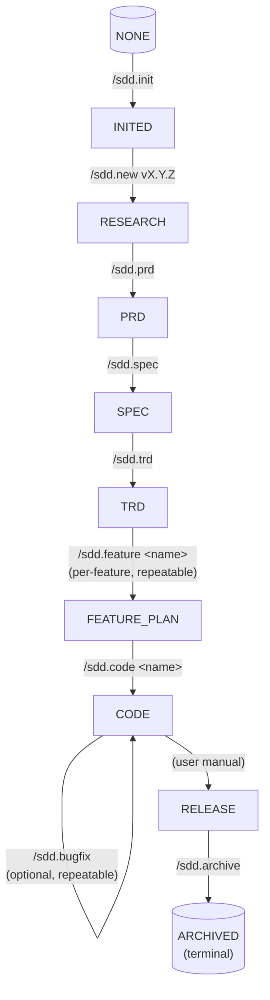

# SDD CodeAgent Plugin — 设计文档

- **日期**：2026-07-07
- **状态**：已批准（brainstorming 阶段完成）
- **作者**：Dachang (@dachang364-tech)
- **仓库**：`SDD-Land-Spec`（本仓库根目录）
- **实现语言**：简体中文（zh-CN）—— 所有面向用户的文案、模板、命令输出、状态信息、文档示例、错误提示、commit 模板均使用中文。命令名、文件路径、glob 模式、配置键、技术术语保留英文。

## 1. 目的与背景

构建一个 CodeAgent Plugin（manifest 形式），把作者本人「规范驱动开发」（Spec-Driven Development，SDD）的工作流封装成 Skills、Commands、Hooks 和运行时状态。该 Plugin 是一个**流程编排器**，不是方法论的重新实现 —— 它从现有框架（Superpowers、Spec-Kit、OpenSpec）中取其精华，与项目本地约定做胶水整合。

### 1.1 目标

- 通过一组明确的斜杠命令与自然语言触发器，把项目从**需求 → 上线 → 归档**完整跑下来。
- 把文档（`spec.md`、`trd.md`、feature plan、ADR）作为一等资产，存放在 `docs/vX.Y.Z/` 之下。
- 通过**阶段许可护栏**：Agent 在错误阶段试图改不该改的文档（如在 TRD 阶段写 spec.md）会被硬拦截，引导回正确阶段。源码本身不设路径白名单 —— 边界纪律由「文档即契约」+ Superpowers TDD 共同保证。
- 优先在 **Claude Code** 上跑通，对 OpenCode、CodeX 等其他 CodeAgent 通过显式的适配层接入。

### 1.2 非目标

- 不重新实现 brainstorming、TDD、verification —— 这些直接消费 Superpowers。
- 不从零写 spec / plan / tasks 模板 —— 借自 Spec-Kit（只做最小化定制）。
- 不构建跨平台运行时抽象层。每个平台单独一份薄薄的 adapter 目录。
- **Plugin 自身不适用 SDD 流程**：Plugin 是工具不是产品。其开发走普通 git workflow（feature branch、PR、CHANGELOG），不创建 `docs/vX.Y.Z/`、`state.json`、不跑 `/sdd.*`。
- **Plugin 的设计文档与 SDD 项目产物分离**：本设计文档目前位于 `docs/superpowers/specs/` 仅因 brainstorming skill 的默认输出位置；正式落地时 Plugin 仓库的设计/计划/ADR 文档应放在独立目录（例如 `plugin-docs/`、`docs/plugin/`），避免与使用 Plugin 的项目自身产生的 `docs/vX.Y.Z/` 命名冲突。

### 1.3 实现语言约束

Plugin 内部所有面向用户的字符串 —— Skill 正文、命令输出、状态报告、模板（`spec.md`、`trd.md`、`feature-*.md`、ADR、bugfix 记录）、错误消息、commit-message 建议 —— 一律使用**简体中文**。以下内容保留英文：

- 斜杠命令名（`/sdd.*`）—— 是用户输入的标识符。
- 文件路径、glob 模式、manifest 键。
- 代码标识符、配置键、约定俗成的英文技术术语（如 `ADR`、`JSON`、`glob` 等）。
- 外部框架文档中的原文引用（如 Superpowers Skill 的标题）。

## 2. 架构总览

```
┌────────────────────────────────────────────────────────────┐
│            SDD CodeAgent Plugin（manifest 形式）            │
├────────────────────────────────────────────────────────────┤
│  Commands（指向 Skills 的薄别名）                            │
│   /sdd.init /sdd.new /sdd.spec /sdd.trd                    │
│   /sdd.research /sdd.prd /sdd.feature /sdd.code            │
│   /sdd.bugfix /sdd.adr /sdd.status /sdd.archive            │
├────────────────────────────────────────────────────────────┤
│  Skills（承载实际方法论）                                    │
│   sdd-init / sdd-new-version                               │
│   sdd-research-writer / sdd-prd-writer                    │
│   sdd-spec-writer / sdd-trd-writer                         │
│   sdd-feature-planner / sdd-code-orchestrator              │
│   sdd-bugfix-triage / sdd-adr-writer                       │
│   sdd-status-reader / sdd-archiver                         │
├────────────────────────────────────────────────────────────┤
│  Hooks（路径 / 状态守卫）                                    │
│   SessionStart         — 向 context 注入项目状态             │
│   PreToolUse Write/Edit — 阶段许可检查（只拦文档类路径）       │
│   PostToolUse Write/Edit — 更新 state.json 时间戳             │
│   PreCompact           — 快照当前阶段产物路径                 │
├────────────────────────────────────────────────────────────┤
│  状态（.sdd/state.json）                                     │
│   version, phase, branch, artifacts, active_bugfix           │
└────────────────────────────────────────────────────────────┘
           ↓ 调用 ↓
┌────────────────────────────────────────────────────────────┐
│  外部框架（不重新实现）                                       │
│   Superpowers: brainstorming / writing-plans / TDD /        │
│                verification-before-completion /             │
│                subagent-driven-development                  │
│   Spec-Kit:    specify / plan / tasks / converge 模板        │
│   OpenSpec:    archive / 变更管理模型                        │
└────────────────────────────────────────────────────────────┘
```

## 3. 状态机

```
NONE --/sdd.init--> INITED --/sdd.new vX.Y.Z--> RESEARCH --/sdd.prd--> PRD --/sdd.spec--> SPEC
                                                                                          |
                                                                                          | /sdd.trd
                                                                                          v
                                                                                         TRD
                                                                                          |
                                                                                          | /sdd.feature <name>     (per-feature, repeatable)
                                                                                          v
                                                                                    FEATURE_PLAN --/sdd.code <name>--> CODE
                                                                                                                      |
                                                                                                                      | /sdd.bugfix     (optional, repeatable)
                                                                                                                      v
                                                                                                            active_bugfix: "bugfix-0002-..."
                                                                                                                      |
                                                                                                                      | (user manual)
                                                                                                                      v
                                                                                                                   RELEASE
                                                                                                                      | /sdd.archive
                                                                                                                      v
                                                                                                                  ARCHIVED
```

如果你的 Markdown 渲染器支持 Mermaid（如 GitHub、Obsidian、Typora ≥ 1.0），下面的版本会自动渲染为流程图（无等宽字体错位问题）：



**回跳语义**：任意阶段都可通过 `/sdd.<目标阶段>` 命令回跳到上游阶段（详见 §8 PreToolUse Hook 与 §7 各 Skill 的命令入口）。`state.json.phase` 写入由**命令入口**而非 Hook 完成，因此 Hook 看到的总是已稳定的 phase。

阶段可以重复进入（例如在 `TRD` 阶段回头编辑 `spec.md`，phase 临时跳回 `SPEC`，改完后回到 `TRD`）。`state.json.phase` 是**当前活动阶段**，不是历史最高。各产物的具体状态存放在 `state.json.artifacts.<name>.status`。

**用户可跳过 `/sdd.research` / `/sdd.prd`**：用户可以自行编写 `research.md` 或 `prd.md`（自由格式），但若想走 `/sdd.spec`，消费的 PRD 必须符合 plugin 模板 schema（详见 §11.1），否则 `/sdd.spec` 会拒绝并提示「PRD 不符合规范，请用 `/sdd.prd` 重写或手动补齐章节」。同样的，`/sdd.feature` 消费的 spec 也需符合 schema。

**关于上游三阶段（RESEARCH / PRD / SPEC）**：三者构成严格链 `research → prd → spec`。Plugin 同时提供 `/sdd.research` 与 `/sdd.prd` 两个命令，均遵循 plugin 模板规范；用户也可以自行完成这两个文档（自由格式），但**若想走 `/sdd.spec`，所消费的 PRD 必须符合 plugin 的 schema**（见 §11 模板清单）。下游不识别时 `/sdd.spec` 会拒绝并提示「PRD 不符合规范，请用 `/sdd.prd` 重写或手动补齐章节」。

### 3.1 `.sdd/state.json` schema

```json
{
  "version": "1.0.1",
  "phase": "TRD",
  "branch": "feat/v1.0.1-payment",
  "artifacts": {
    "research": { "path": "docs/v1.0.1/research.md",   "status": "approved", "updated_at": "2026-07-07T08:00:00Z" },
    "prd":   { "path": "docs/v1.0.1/prd.md",       "status": "approved", "updated_at": "2026-07-07T09:00:00Z" },
    "spec":  { "path": "docs/v1.0.1/specs/spec.md",  "status": "approved", "updated_at": "2026-07-07T10:00:00Z" },
    "trd":   { "path": "docs/v1.0.1/plans/trd.md",   "status": "draft",    "updated_at": "2026-07-07T11:00:00Z" },
    "features": [
      { "name": "feature-login",   "path": "docs/v1.0.1/plans/feature-login.md",   "status": "planned" },
      { "name": "feature-payment", "path": "docs/v1.0.1/plans/feature-payment.md", "status": "coding" }
    ],
    "adrs": [
      { "id": "0001-use-postgresql", "path": "docs/v1.0.1/decisions/0001-use-postgresql.md", "status": "accepted" }
    ]
  },
  "active_bugfix": null,
  "compaction_snapshot": null
}
```

**status 取值**：`missing` | `draft` | `approved` | `deprecated`。`/sdd.new` 不预创建 `prd.md`，因此新建版本后 `artifacts.prd.status = "missing"`；`/sdd.prd` 完成后变 `draft`，用户批准后变 `approved`。`spec` / `trd` / `features.*` 同理。

**v0.1 不引入 `guards` 字段**：v0.1 阶段不实施「Coverage Scope 路径白名单」护栏。Hook 退化为「阶段许可」（详见 §8）。后续版本如需恢复路径白名单，作为不破坏 schema 的扩展字段加回。

## 4. 目录结构

```
<project root>/
├── .sdd/
│   └── state.json
├── docs/
│   ├── vX.Y.Z/                         # 当前进行中的版本
│   │   ├── research.md                  # 需求调研（Plugin 模板规范）
│   │   ├── prd.md                       # 产品需求文档（Plugin 模板规范）
│   │   ├── specs/
│   │   │   └── spec.md                 # 功能规范（output，Spec-Kit 风格）
│   │   ├── plans/
│   │   │   ├── trd.md                  # 版本级技术设计
│   │   │   ├── feature-login.md        # 单 feature 实现计划
│   │   │   └── feature-payment.md
│   │   └── decisions/
│   │       ├── 0001-use-postgresql.md  # ADR
│   │       └── bugfix-0002-fix-null.md # bugfix 记录（轻量 ADR）
│   └── archive/
│       └── v1.0.0/                     # 已归档版本（迁移过来，不双份并存）
│           ├── research.md
│           ├── prd.md
│           ├── specs/spec.md
│           ├── plans/
│           └── decisions/
└── （源代码目录，不动）
```

### 4.1 文档层级与三层递进

`docs/vX.Y.Z/` 下的文档**不是同层并列**，而是**三层递进**：

```
research.md            ← 需求调研：问题陈述 / 用户 / 痛点 / 竞品 / 范围 / 目标（Plugin 模板）
  └─ 抽取产品需求
prd.md                  ← 产品层：业务目标 / 用户 / 范围 / 指标（1 份，Plugin 模板）
  └─ 拆成 feature
spec.md                 ← 功能层：每个 feature 的 User Story（P1/P2/P3）与验收标准（Spec-Kit Given-When-Then）（1 份）
  └─ 决定技术选型与覆盖范围
trd.md                  ← 版本级技术层：vX.Y.Z 整体技术方案（1 份；推荐影响面）
  └─ 按 feature 拆实现
feature-login.md        ← 单 feature 实现层：user story → task，含 TDD 步骤 + commit 粒度（N 份）
feature-payment.md
  └─ 派给 subagent
源码 + 提交
```

**层级关系**：`feature > user story > task`。
- 一个 PRD 通常拆成 N 个 feature（如「登录」「支付」）。
- 一个 feature 含 N 个 user story（spec.md 里 P1/P2/P3 切片）。
- 一个 user story 拆成 N 个 task（feature-*.md 里的 `[ID] [P?] [Story]`）。

| 维度               | `trd.md`                                                | `feature-<name>.md`                                    |
| ------------------ | ------------------------------------------------------- | ------------------------------------------------------ |
| 数量               | 1 份                                                    | 按需 N 份                                              |
| 粒度               | 粗：架构、模块、契约、（推荐）影响面                    | 细：具体文件、具体任务、TDD 步骤、commit 粒度          |
| 回答的问题         | "vX.Y.Z 整体怎么做？"                                   | "feature-X 这个模块具体怎么落地？"                     |
| 类比外部框架       | Spec-Kit `/speckit.plan`                                | Superpowers `writing-plans`                            |
| 任务列表           | 只列 feature 名，不展开任务                             | 详细任务列表（`[ID] [P?] [Story] <描述>`）              |
| 谁执行             | `/sdd.trd`                                              | `/sdd.feature <name>`                                  |

**撰写约定**：
- `trd.md` 在「模块拆分」一节列出本版本包含的所有 feature，作为 `feature-*.md` 列表的来源。
- 每个 `feature-*.md` 顶部显式引用 `> 上游：docs/vX.Y.Z/plans/trd.md 第 N 节`，确保可追溯。
- 跨 feature 改动对方文件**没有护栏拦截**（v0.1），但 review 时应回到 trd.md 标注影响面。

## 5. 命令与 Skill 对应

| 命令               | 内部 Skill                  | 写入路径                                              | 前置条件                |
| ------------------ | --------------------------- | ----------------------------------------------------- | ----------------------- |
| `/sdd.init`        | `sdd-init-runner`          | `.sdd/`、`docs/`                                      | —                       |
| `/sdd.new vX.Y.Z`  | `sdd-new-version-bootstrapper` | `docs/vX.Y.Z/{research.md,prd.md,specs,plans,decisions}/`、`state.json` | 项目已初始化         |
| `/sdd.research`    | `sdd-research-writer`       | `docs/vX.Y.Z/research.md`                             | phase ≥ INITED          |
| `/sdd.prd`         | `sdd-prd-writer`            | `docs/vX.Y.Z/prd.md`                                  | research approved（推荐） |
| `/sdd.spec`        | `sdd-spec-writer`           | `docs/vX.Y.Z/specs/spec.md`                           | prd 存在且符合规范     |
| `/sdd.trd`         | `sdd-trd-writer`            | `docs/vX.Y.Z/plans/trd.md`                            | spec 已批准             |
| `/sdd.feature X`   | `sdd-feature-planner`       | `docs/vX.Y.Z/plans/feature-X.md`                      | trd 已批准              |
| `/sdd.code X`      | `sdd-code-orchestrator`     | 源文件（通过 subagent + TDD）                         | `feature-X.md` 存在     |
| `/sdd.bugfix`      | `sdd-bugfix-triage`         | `decisions/bugfix-*.md` + 代码                        | phase = CODE            |
| `/sdd.adr`         | `sdd-adr-writer`            | `docs/vX.Y.Z/decisions/NNNN-*.md`                     | phase ≥ INITED（横切） |
| `/sdd.status`      | `sdd-status-reader`         | （无）                                                | —                       |
| `/sdd.archive`     | `sdd-archiver`              | `docs/archive/vX.Y.Z/`                                | phase = RELEASE         |
| `/sdd.doctor`      | `sdd-doctor-runner`         | （无；只读）                                          | —                       |

每个 Skill 同时支持自然语言触发：Skill 的 `description` 字段按用户可能的说法撰写，所以用户即使说「帮我写一下支付功能的 spec」，也能命中 `sdd-spec-writer`，不必输入斜杠命令。

**横切命令**：`/sdd.adr` 与 `/sdd.doctor` 是横切命令，可从任何阶段（`/sdd.adr` 要求 phase ≥ INITED；`/sdd.doctor` 任意）调用，不改变 `state.json.phase`。其余命令都是顺序主流程命令。

## 6. 各阶段外部框架组合

| 阶段        | Plugin Skill              | 外部框架层                                                              |
| ----------- | ------------------------- | ----------------------------------------------------------------------- |
| 需求调研    | `sdd-research-writer`     | Superpowers `brainstorming` 流程 + Plugin 原生 research 模板            |
| PRD         | `sdd-prd-writer`          | Superpowers `brainstorming` 流程 + Plugin 原生 PRD 模板；输入 research.md |
| 需求（spec）| `sdd-spec-writer`         | 读取 PRD 作为输入；调用 Superpowers `brainstorming` 流程；用 Spec-Kit `spec.md` 模板（User Story、Given-When-Then）**融合** Spec-Kit `plan-template.md` 的项目层章节（Technical Context / Constitution Check / Project Structure） |
| 技术设计（TRD） | `sdd-trd-writer`          | 纯 Superpowers `writing-plans` 风格（文件级任务、TDD 步骤、commit 粒度） |
| Feature 计划 | `sdd-feature-planner`     | Superpowers `writing-plans` 流程（文件级任务、TDD 步骤、commit 粒度）   |
| 编码        | `sdd-code-orchestrator`   | Superpowers `subagent-driven-development` + `test-driven-development` + `verification-before-completion` |
| Bug 修复    | `sdd-bugfix-triage`       | Plugin 内部决策树（见 §7.8）                                            |
| ADR         | `sdd-adr-writer`          | Plugin 原生（MADR 风格模板）                                            |
| 状态        | `sdd-status-reader`       | Plugin 原生                                                              |
| 归档        | `sdd-archiver`            | Spec-Kit `/speckit.converge` 查漏 + OpenSpec 归档模型                    |
| 诊断        | `sdd-doctor-runner`       | 不调外部框架；纯 Plugin 原生只读自检（详见 §7.12）                       |

## 7. 关键 Skill — 内部行为

> 编号自 7.0 起按仓库 `skills/` 目录的字典序编排。`sdd-init-runner`（7.0）、`sdd-new-version-bootstrapper`（7.1）属于项目级启动 Skill；`sdd-research-writer`～`sdd-doctor-runner`（7.2～7.13）属于版本级阶段 Skill。**13 个 Skill 一一对应 §11 列出的 13 个目录**。

### 7.0 `sdd-init-runner`

1. 检测当前项目是否已初始化（`.sdd/state.json` 是否存在）。若已存在 → 拒绝并提示「已初始化，请用 `/sdd.status` 查看当前状态」。
2. 创建 `.sdd/` 目录与 `state.json` 初始骨架（`version = "0.0.0"`、`phase = "INITED"`、`artifacts = {}`）。
3. 创建 `docs/` 目录结构。
4. **不**预创建任何版本目录；版本目录由 `/sdd.new` 启动。
5. 若项目根不是 git 仓库，**不强制** git init，但提示「建议先 `git init` 以便后续归档写入 commit」。

### 7.1 `sdd-new-version-bootstrapper`

1. 要求项目已初始化（`state.json.version != "0.0.0"` 或 `phase = "INITED"`）。
2. 解析用户提供的版本号（`/sdd.new vX.Y.Z`），校验 semver。
3. 创建 `docs/vX.Y.Z/{research,specs,plans,decisions}/` 四个子目录。
4. 初始化各 artifacts 占位为 `missing`（research / prd / spec / trd / features / adrs）。
5. `state.json.version = "vX.Y.Z"`、`phase = "RESEARCH"`。
6. 创建 `git checkout -b feat/vX.Y.Z-<name>`（若项目是 git 仓库；非 git 项目跳过，仅提示）。

### 7.2 `sdd-research-writer`

1. 读取 `state.json`。若 `phase < INITED`，直接拒绝。
2. 调用 **Superpowers `brainstorming`** 流程：一次问一个澄清问题，围绕「要解决什么问题、用户是谁、用户痛点、竞品现状、初步范围」。
3. 用 Plugin 原生 research 模板填充：问题陈述 / 目标用户画像 / 痛点清单 / 竞品对比 / 初步范围（in/out）/ 可衡量的目标。
4. 写入 `docs/vX.Y.Z/research.md`。
5. 更新 `state.json.artifacts.research.status = draft`。
6. **硬门**：用户未明确批准 research 前不推进 phase。批准后 `status = approved` 且 `phase = RESEARCH`。
7. 用户也可跳过本命令，自行编写 `research.md`（自由格式）。`/sdd.prd` 会做轻量校验：缺关键章节时提示补齐，但不强制。

### 7.3 `sdd-prd-writer`

1. 读取 `state.json`。若 `phase < INITED`，直接拒绝。
2. 调用 **Superpowers `brainstorming`** 流程：一次问一个澄清问题，最多 5 个，围绕「要解决什么问题、为谁、成功的标准、范围边界」。
3. 用 Plugin 原生 PRD 模板填充：项目背景 / 目标用户 / 核心问题 / 业务目标 / 范围（in/out）/ 关键指标 / 时间盒。
4. 写入 `docs/vX.Y.Z/prd.md`。
5. 更新 `state.json.artifacts.prd.status = draft`。
6. **硬门**：用户未明确批准 PRD 前，不推进 `phase`。批准后 `status = approved` 且 `phase = PRD`。
7. PRD 既可由本命令生成，也可由人工提前放置（状态为 `approved`）。`/sdd.spec` 不区分 PRD 来源。

### 7.4 `sdd-spec-writer`

1. 读取 `state.json` 与 `docs/vX.Y.Z/prd.md`；若 PRD 未批准则拒绝，并提示「先 `/sdd.prd` 或人工放置 PRD」。
2. 调用 **Superpowers `brainstorming`** 流程：基于 PRD 抽取 User Story，一次问一个澄清问题，最多 5 个。
3. 用 Spec-Kit `spec-template.md` 骨架填充：User Story（P1/P2/P3）、Acceptance Scenarios（Given-When-Then）、**并融合 Spec-Kit `plan-template.md` 中的项目层章节**（Technical Context / Constitution Check / Project Structure）作为 spec.md 的「项目层元信息」部分。
4. **保留引用**：在 `spec.md` 头部写明「输入 PRD：`docs/vX.Y.Z/prd.md`」、「输入 research：`docs/vX.Y.Z/research.md`」（如存在），确保可追溯。
5. 写入 `docs/vX.Y.Z/specs/spec.md`。
6. 更新 `state.json.artifacts.spec.status = draft`。
7. **硬门**：用户未明确批准 spec 前，不推进 `phase`。批准后 `status = approved` 并 `phase = SPEC`。

### 7.5 `sdd-trd-writer`

**职责**：纯 Superpowers `writing-plans` 风格，写「面向零上下文工程师的版本级技术实现步骤」。Spec-Kit 的项目层元信息（Technical Context / Constitution Check / Project Structure）已在 `spec.md` 中包含，**trd 不再重复**。

1. 读取 spec.md；若 spec 未批准则拒绝。
2. 调用 **Superpowers `writing-plans`** 流程，逐个收集技术决策（一次一个问题）。
3. 用 Superpowers writing-plans 骨架填充：文件结构、任务列表（含文件路径）、TDD 步骤、commit 粒度。
4. **推荐章节（v0.1 非强制）**：`## Coverage Scope`，列出本版本涉及的关键文件 / 目录（gitignore 风格 glob），便于 review 时一眼看清影响面。该章节不写入任何 `state.json` 字段，也**不**作为护栏依据 —— v0.1 不实施路径白名单。
5. 用户批准后，当至少存在一个 feature plan 时，`phase = FEATURE_PLAN`。

### 7.6 `sdd-feature-planner`

1. 读取 trd.md；若 trd 未批准则拒绝。
2. 针对命名的 feature 调用 **Superpowers `writing-plans`** 全流程。
3. 产出 `docs/vX.Y.Z/plans/feature-<name>.md`，包含以下章节：
   - 文件结构（具体到要改的文件清单）
   - 任务列表 `[ID] [P?] [Story] <带文件路径的描述>`
   - 每个任务的 TDD 步骤（写测试 → 看红 → 写实现 → 看绿 → 提交）
   - Commit 粒度建议
4. **不另起 `tasks.md`** —— 任务内嵌在 plan 文档里，与 Superpowers 约定一致。
5. 用户批准后，把 `artifacts.features[name].status` 标记为 `planned`。

### 7.7 `sdd-code-orchestrator`

**进度基线**：直接沿用 Superpowers `subagent-driven-development` 的三个反上下文爆炸机制 —— **Fresh subagent per task** + **Ledger 持久化进度** + **文件交接而非粘贴文本**。本节仅记录我们与 Superpowers 的差异点。

1. 确认 `feature-<name>.md` 存在且已批准。
2. 调用 **Superpowers `subagent-driven-development`**，**不拆 plan**，逐 task 派发单 subagent。
3. 任务级别循环（每个 task 独立走完整轮）：
   - Implementer subagent：写失败测试 → 实现 → 通过测试 → 提交。
   - Task reviewer subagent：spec ✅ + 质量 ✅ → 写完成行到 ledger。
   - 每次提交前 / 提交后调用 `verification-before-completion`。
4. **Ledger 持久化**（核心新增，复用 Superpowers 机制、换路径）：
   - 路径：`<repo>/.sdd/progress.md`（**不**复用 `.superpowers/sdd/progress.md`，避免与 Superpowers 自身命名冲突 —— 见 K10）。
   - Skill 启动时 `cat` 该文件，**已完成 task 一律跳过**，避免重派（来源：Superpowers 「real session 一次性把整段 task 序列重派」是真实失败案例）。
   - 每个 task 的 review 通过后追加一行：`Task <N>: complete (commits <base7>..<head7>, review clean)`。
5. **文件交接优于文本粘贴**（沿用 Superpowers 约束）：
   - dispatch prompt 仅含：(a) 一句话项目背景；(b) 用 `task-brief PLAN_FILE N` 抽取的 brief 文件路径；(c) 上游任务产出的接口 / 决策摘要；(d) report 文件路径与回执契约。
   - **禁止**在 dispatch prompt 中粘贴累积历史（来源：Superpowers 「真实 session dispatch 42k 字符，其中 99% 是粘贴历史」）。
6. **PreToolUse Hook**（v0.1）不拦截源码路径；只对 `docs/vX.Y.Z/**` 文档路径做阶段许可检查。subagent 写源码时**无路径白名单约束**。
7. **state.json 同步**：subagent 与主 Agent **不共享** `state.json`。implementer 报告由 ledger 持久化（`progress.md` 才是真账），主 Agent 仅在 feature 整体完成时把 `artifacts.features[name].status` 推进到 `done`，并把任何跨 task 遗漏写进 `compaction_snapshot`。
8. **崩溃恢复**：主 Agent 下次 `SessionStart` 触发 `sdd-status-reader`，扫描 `progress.md` + `git log` 识别「最近完成行」之后的未完成 task，提示「之前中断，从 Task N 继续？」。**信任 ledger 与 git log，不信任自己的会话记忆**。

### 7.8 `sdd-bugfix-triage`

**职责范围**：本 Skill 只做「流程路由」（决定走哪条分支、生成什么记录），不替代 Superpowers `systematic-debugging` 做根因诊断。

决策树（由 Skill 内部执行，不是用户驱动）：

```
Q1：本次修复是否改变 spec 定义的行为或验收标准？
    是 → 规范 bug → 提议写 ADR
    否 → 代码 bug → 写轻量 bugfix 记录

Q2（若是规范 bug）：本次修复是否改变 TRD 覆盖范围？
    是 → 先更新 trd.md
    否 → 仅更新 spec.md（diff 段）
```

处置路径：

- **代码 bug（轻量）**
  - 写 `docs/vX.Y.Z/decisions/bugfix-NNNN-<title>.md`（MADR 风格，但使用「现象 / 根因 / 修复 / 影响」布局）。
  - 通过 TDD 循环修复代码；把对应任务追加到相关 feature plan 的任务列表中。
- **规范 bug（完整）**
  - 写 ADR `000N-<title>.md`。
  - 用显式的 `[CHANGED]` diff 块更新 `spec.md`。
  - 若覆盖范围变化，更新 `trd.md` 并重新解析 `state.json.guards.trd_covered_modules`。
  - 对受影响的 feature 继续走 `/sdd.code` 流程。

### 7.9 `sdd-adr-writer`

Plugin 原生。模板如下：

```md
# ADR NNNN：<标题>

- 状态：proposed | accepted | deprecated
- 日期：YYYY-MM-DD
- 背景：<当前的约束与驱动力>
- 决策：<我们选择了什么>
- 后果：<正面、负面、后续行动>
```

### 7.10 `sdd-archiver`

1. 要求 `phase = RELEASE`（由用户手动设置或通过发布 hook 触发）。
2. 调用 Spec-Kit `/speckit.converge` 检测各 feature plan 中未完成的工作；若有未完成任务，在用户未明确「强制归档」前拒绝。
3. **探测 git 可用性并自适应迁移**：
   - 若当前项目根目录是 git 仓库（即 `git rev-parse --is-inside-work-tree` 返回 `true`）：使用 `git mv docs/vX.Y.Z/ docs/archive/vX.Y.Z/`。提交一次 `chore(archive): migrate vX.Y.Z`。
   - 若当前项目**不是** git 仓库：使用纯文件 `mv docs/vX.Y.Z docs/archive/vX.Y.Z`，并在归档报告末尾追加一行 `⚠️ 当前项目不是 git 仓库，无法写入归档 commit；如需 git 历史，请先 git init 并补一次初始提交。`。
   - 文档不双份并存，无论 git / 非 git 模式均**先迁移再标记** state.json。
4. 把 `state.json.phase` 标记为 `ARCHIVED`，清空 `guards`，版本字段保留 `vX.Y.Z` 作为只读历史。
5. 归档后 `docs/` 下不再有 `vX.Y.Z/` 同名目录；要查阅历史文档只能从 `docs/archive/vX.Y.Z/` 走。

**为什么这么设计**：v0.1 不强制项目必须是 git 仓库（虽然 init 时会鼓励 `git init`）。归档路径语义在两种模式下完全一致 —— 「目录物理迁移到 archive」，唯一的差异是有 git 时由 git 负责记录历史，无 git 时由文件系统负责。

### 7.11 `sdd-status-reader`

报告：当前 `version`、`phase`、缺失的产物、`proposed` 状态的 ADR、下一步推荐的斜杠命令。

### 7.12 `sdd-doctor-runner`

**职责**：只读诊断命令，输出统一清单。**不**自动修复，**不**改变 `state.json.phase`。横切命令（见 §5）。

诊断项分两组，输出 `✅ / ⚠️ / ❌` 三档：

**A. Plugin 自身安装完整性**（诊断当前 Plugin 仓库是否完整）：

| 检查项                              | 通过条件                                                                 |
| ----------------------------------- | ------------------------------------------------------------------------ |
| Plugin manifest                     | `.claude-plugin/plugin.json` 存在，`name` / `version` / `description` 字段非空 |
| 13 个 Skill 目录                    | `skills/sdd-{init-runner,new-version-bootstrapper,research-writer,prd-writer,spec-writer,trd-writer,feature-planner,code-orchestrator,bugfix-triage,adr-writer,archiver,status-reader,doctor-runner}/SKILL.md` 全部存在 |
| 13 个 command 文件                  | `commands/sdd.{init,new,research,prd,spec,trd,feature,code,bugfix,adr,status,archive,doctor}.md` 全部存在 |
| Hooks 配置                          | `hooks/hooks.json` 合法 JSON，四个事件都注册（SessionStart / PreToolUse / PostToolUse / PreCompact） |
| Templates 齐备                      | `templates/{research,prd,spec,trd,feature-plan,adr,bugfix}.md.tmpl` 全部存在 |
| Scripts 齐备                        | `scripts/{init,archive,status,render-template}.js`（或 .sh）全部存在     |

**B. 项目状态诊断**（诊断当前正在使用 SDD 的项目仓库）：

| 检查项                              | 通过条件                                                                 |
| ----------------------------------- | ------------------------------------------------------------------------ |
| `.sdd/state.json` 可解析            | JSON 合法，schema 字段齐全（`version` / `phase` / `branch` / `artifacts`）|
| 当前 phase 与文档路径一致           | `phase = PRD` 时 `prd.md.status == approved`；`phase = SPEC` 时 `spec.md.status == approved`；依此类推 |
| 文档目录 vs state.json 路径一致     | 每个 `artifacts.*.path` 字段对应的文件真实存在                            |
| `.sdd/progress.md` 与 git log 一致   | ledger 中标记 complete 的 task IDs 都能在 `git log` 中找到对应 commit hash 段 |
| 顶层模块变更提示                    | 最近 N 次提交新增了 `src/<new-module>/` 且没有对应 `decisions/*.md` 时，输出 `⚠️ 建议补一条 ADR` |

输出格式示例：

```
/sdd.doctor

Plugin 自身安装
  ✅ .claude-plugin/plugin.json
  ✅ 13 个 Skill 目录
  ⚠️ commands/sdd.doctor.md 缺失（新增命令后忘了同步 commands/）
  ✅ hooks/hooks.json
  ✅ Templates 齐备
  ✅ Scripts 齐备

项目状态（当前仓库）
  ✅ .sdd/state.json 可解析
  ⚠️ phase = TRD 但 specs/spec.md.status = draft（请运行 /sdd.spec 批准）
  ✅ 文档目录 vs state.json 路径一致
  ✅ progress.md 与 git log 一致

下一步建议：批准 specs/spec.md 后再 /sdd.trd。
```

**已知不做**：不检测外部框架（Superpowers / Spec-Kit / OpenSpec）的可达性 —— 这是用户的环境配置问题，不属于 Plugin 自检范围。

## 8. Hooks

| Hook                    | 触发时机                  | 动作                                                                       |
| ----------------------- | ------------------------- | -------------------------------------------------------------------------- |
| `SessionStart`          | Agent 启动 / 恢复会话     | 读取 `state.json`，把摘要 `<plugin>active version=...phase=...missing=[...] next=/sdd.<x>` 注入 context（Claude Code 的 `hookSpecificOutput.additionalContext`）。 |
| `PreToolUse Write/Edit` | 即将写入                  | **仅检查文档类路径**：目标路径命中 `docs/vX.Y.Z/**` 时，按路径查「该路径对应的合法阶段集合」是否包含 `state.json.phase`。<br>- `research.md` ↔ `RESEARCH`<br>- `prd.md` ↔ `PRD`<br>- `specs/spec.md` ↔ `SPEC`<br>- `plans/trd.md` ↔ `TRD`<br>- `plans/feature-*.md` ↔ `FEATURE_PLAN`、`CODE`<br>- `decisions/**` ↔ 任何阶段（ADR/bugfix 是横切产物）<br>**phase 上下跳的处理**：用户想从 SPEC 阶段回跳改 `prd.md`，**不能**直接 Edit —— 必须调用 `/sdd.prd` 等命令入口。该命令入口在内部把 `phase` 切到目标阶段后，再调起对应的 Skill 写文档；Hook 始终读到的是**已稳定**的 phase，不会看到「写之前的瞬态切换」。<br>越阶段 → 退出码 2 + 提示「请运行 `/sdd.<对应阶段>`」。**v0.1 不拦截源码路径**。 |
| `PostToolUse Write/Edit`| 写入完成                  | ① 文档路径命中 `docs/vX.Y.Z/**` → 更新对应 `artifacts.<name>.status = draft`、`updated_at` 时间戳。<br>② 源码路径 → 更新 `state.json.last_modified`；若新增了顶层模块，提示「建议补一条 ADR」。 |
| `PreCompact`            | 会话压缩                  | 把当前阶段产物路径快照写入 `state.json.compaction_snapshot`。下次 `SessionStart` 会重新注入，使被压缩过的 context 能找回这些文件路径。 |

Hooks **不**对方法论本身做二次判断（不审 spec 文字、不做 TDD 强制 —— 这些都在 Skill 里）。Hooks 只守护路径合法性与状态机一致性。

## 9. 错误处理

| 失败场景                            | 用户可见的表现                                                | 恢复方式                                                   |
| ----------------------------------- | ------------------------------------------------------------- | ---------------------------------------------------------- |
| `state.json` 缺失 / 损坏            | 「项目未初始化。请运行 `/sdd.init`。」                        | 运行 `/sdd.init`                                           |
| PRD 缺失或不符合 schema            | `/sdd.spec` 拒绝并提示「请先运行 `/sdd.prd` 或手动补齐 PRD 至符合规范。」 | 运行 `/sdd.prd` 或手动补齐 PRD 章节                     |
| 阶段跳跃（例如无 PRD 直接 `/sdd.spec`） | 命令拒绝并说明原因                                            | 运行前置命令                                               |
| 文档路径在错误阶段被改              | PreToolUse 退出码 2 并提示「请运行 /sdd.<对应阶段>」           | 切换到正确阶段                                             |
| 归档时仍有未完成任务                | `/sdd.archive` 拒绝并列出未完成项                              | 完成对应任务，或明确确认「仍然归档」                       |
| 脚本 IO / 网络失败                  | 抛出错误，**不破坏** `state.json`                             | 重跑；必要时从 `compaction_snapshot` 恢复                  |

## 10. 测试策略

| 层                              | 测试目标                                                       | 工具                                                       |
| ------------------------------- | -------------------------------------------------------------- | ---------------------------------------------------------- |
| 模板                            | 检查必要章节存在                                               | `bash` / `node` 快照对比脚本                                |
| Hook 与归档脚本                 | 单元级行为                                                     | `bats` / `shunit2`                                         |
| Skill 行为（端到端）            | 准备 mock `state.json`，注入用户输入，断言输出                 | Claude Code headless 调用；将产物与 golden snapshot 对比   |
| Hook 行为（集成）               | 准备临时仓库，驱动 Write 工具，断言「阶段许可」拦截            | `bats` 驱动真实的 agent 子进程                             |
| 跨平台 adapter smoke            | 为每个 adapter 生成产物，跑对应宿主加载器                       | v0.1 阶段人工验收；后续补 CI 脚本                          |

**YAGNI**：不做平台 mock 抽象层；不额外设置超出上表的覆盖率指标。

## 11. 平台适配策略

**v0.1 范围声明**：本版本仅交付 **Claude Code adapter**。OpenCode / CodeX / Cursor / Copilot CLI 等其他平台**不在 v0.1 范围**，等 Claude Code 版本稳定后再启动跨平台评估（见 §11.1）。

**没有 build.sh、没有 sources/adapters 中间层**（YAGNI）。Claude Code 直接消费仓库根目录，仓库根就是 Plugin 根。预期布局：

```
sdd-codeagent-plugin/
├── .claude-plugin/
│   └── plugin.json                 # Claude Code plugin manifest
├── commands/                        # /sdd.* 的薄别名（指向同名 Skill）
│   ├── sdd.init.md
│   ├── sdd.new.md
│   ├── sdd.research.md
│   ├── sdd.prd.md
│   ├── sdd.spec.md
│   ├── sdd.trd.md
│   ├── sdd.feature.md
│   ├── sdd.code.md
│   ├── sdd.bugfix.md
│   ├── sdd.adr.md
│   ├── sdd.status.md
│   └── sdd.archive.md
├── skills/                          # 13 个 Skill，每个 Skill 一个目录
│   ├── sdd-init-runner/
│   ├── sdd-new-version-bootstrapper/
│   ├── sdd-research-writer/
│   ├── sdd-prd-writer/
│   ├── sdd-spec-writer/
│   ├── sdd-trd-writer/
│   ├── sdd-feature-planner/
│   ├── sdd-code-orchestrator/
│   ├── sdd-bugfix-triage/
│   ├── sdd-adr-writer/
│   ├── sdd-archiver/
│   └── sdd-status-reader/
├── hooks/
│   └── hooks.json                  # SessionStart / PreToolUse / PostToolUse / PreCompact
├── templates/                       # research / prd / spec / trd / feature-plan / adr / bugfix
├── scripts/                         # init / archive / status / template-render
├── docs/
│   └── superpowers/
│       └── specs/
│           └── 2026-07-07-sdd-codeagent-plugin-design.md   # 本文档
├── README.md
└── LICENSE
```

**安装方式**：`/plugin install <repo-url>`（Claude Code marketplace 或 git 直装）；无需 build 步骤，仓库即产物。

**模板渲染**：Skill 运行时由脚本（如 `scripts/render-template.js`）读取 `templates/*.md.tmpl`，把变量替换后写入 `docs/vX.Y.Z/`。这是 Skill 内部步骤，与构建无关。

### 11.1 跨平台适配 —— 后续节奏

v0.1 **不**预留任何平台抽象层（YAGNI）。等 Claude Code adapter 稳定并经过实战验证后，再按以下顺序评估迁移：

- **候选 1**：OpenCode —— 需先验证其 loadout 模型对 Skills / Hooks / Subagents 三件套的实际支持度。若不全支持，按三档回退：全能力 / 缺 Hooks（无阶段护栏，命令顺序推进自负） / 仅 `/sdd.status` 与命令别名。
- **候选 2+**：CodeX、Cursor、Copilot CLI —— 按需求追加。

**触发条件**：Claude Code v0.1 在真实项目里跑完 1-2 个完整版本（research → archive），积累足够用户反馈后再启动。

## 12. 开放问题 / 后续工作

- **state.json 并发**：v0.1 假定**主 Agent 是 state.json 的唯一写者**，subagent 通过 `.sdd/progress.md` 间接表达进度。**v0.1 不处理跨会话并发**（两个终端同时动 state.json）—— 不加文件锁、不做乐观合并。如果未来出现跨会话需求，再决定加 `.sdd/state.lock`（fcntl / Windows 兼容）还是改成 event-sourced。

- **Hook 脚本语言**：Claude Code 同时支持 bash 与 node hook，OpenCode 可能不同。逐 adapter 决定而非一刀切。
- **Bugfix 自动分类**：当前由 Skill 内部走决策树。若用户觉得过于严格，后续可加启发式规则（文件数量、变更行数、是否触及 spec 表面）做预分类。
- **跨版本 PRD 演子**：当前设计假定新版本独立起，PRD 需从 `docs/archive/<prev>/prd.md` 手工复制后再改。后续可加 `/sdd.new v1.0.1 --base v1.0.0` 简化。
- **多版本并行**：当前设计假定同一时间只有一个活跃版本。若出现并行维护分支（如同时维护 v1.0.x 与 v2.0.0），`state.json` 当前只支持单一版本 —— 后续可扩展为多版本数组。
- **Plugin 分发**：v0.1 稳定后，对接公开 plugin 市场（Claude Code 的 `claude-plugins-official`、OpenCode 的 loadout registry）。

## 13. 验收标准

v0.1 视为完成，当且仅当：

1. Plugin 能从本仓库安装进 Claude Code。
2. 用户能在一个空白仓库里依次运行 `/sdd.init` → `/sdd.new v0.0.1` → `/sdd.research` → `/sdd.prd` → `/sdd.spec` → `/sdd.trd` → `/sdd.feature demo` → `/sdd.code demo`，**仅在阶段门控点（research / PRD / spec / trd 批准）由用户做一次批准**，阶段之间不需用户写额外指导。
3. 在错误阶段试图改 `docs/vX.Y.Z/` 下的文档（如在 TRD 阶段写 `specs/spec.md`）会被 PreToolUse 硬拦截，并提示「请运行 /sdd.<对应阶段>」。
4. `/sdd.status` 在每个阶段都准确反映当前状态（包括 research / prd 状态、`active_bugfix`）。
5. `/sdd.archive` 能把 `docs/v0.0.1/` 通过 `git mv` 迁移到 `docs/archive/v0.0.1/`（包括 `research.md` / `prd.md`），原位置不再保留，并清空 `state.json.active_bugfix`。
6. 所有对外部框架（Superpowers / Spec-Kit / OpenSpec）的调用都通过 Skill 编排，不在 Plugin 内部复制实现。